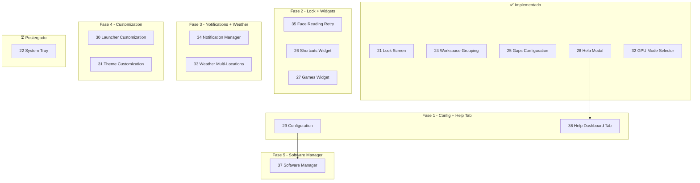

# Sequência de Implementação Recomendada

**Última atualização**: 2026-02-05

Este documento define a ordem recomendada para implementar os planos, considerando dependências técnicas, prioridade de uso e complexidade.

---

## Diagrama de Dependências

---

## Sequência Detalhada

### ✅ Implementado

| Plano | Status |
|-------|--------|
| **21** Lock Screen Auth Selector | ✅ Implementado (v0.1.0) |
| **24** Workspace Visual Grouping | ✅ Implementado |
| **25** Gaps Configuration | ✅ Implementado |
| **28** Help Modal | ✅ Implementado (212 linhas) |
| **32** GPU Mode Selector | ✅ Implementado |

---

### Fase 1: Configuration + Help Tab

| Ordem | Plano | Tempo | Motivo |
|-------|-------|-------|--------|
| 1 | **29** Configuration Panel | 6-8h | Painel de configuração central; usa FileView (não precisa CUtils) |
| 2 | **36** Help Dashboard Tab | 3-4h | Reutiliza shortcuts de HelpModal.qml; nova aba no Dashboard |

**Total Fase 1**: ~9-12h

---

### Fase 2: Lock Screen + Widgets na Barra

| Ordem | Plano | Tempo | Motivo |
|-------|-------|-------|--------|
| 3 | **35** Face Reading Retry | 4-6h | Complementa Lock Screen; baixa complexidade |
| 4 | **26** Shortcuts Widget | 6-8h | Widget configurável na barra |
| 5 | **27** Games Widget | 8-10h | Steam favorites; parsing VDF |

**Total Fase 2**: ~18-24h

---

### Fase 3: Notifications + Weather

| Ordem | Plano | Tempo | Motivo |
|-------|-------|-------|--------|
| 6 | **34** Notification Manager | 12-16h | Histórico já existe; adicionar blockedApps + iconOverrides |
| 7 | **33** Weather Multi-Locations | 6-8h | Refatorar Weather service |

**Total Fase 3**: ~18-24h

---

### Fase 4: Customization

| Ordem | Plano | Tempo | Motivo |
|-------|-------|-------|--------|
| 8 | **30** Launcher Customization | 6-8h | Editar ícones/nomes de apps |
| 9 | **31** Theme Customization | 10-15h | Gerar paleta M3; mais complexo |

**Total Fase 4**: ~16-23h

---

### Fase 5: Software Manager

| Ordem | Plano | Tempo | Motivo |
|-------|-------|-------|--------|
| 10 | **37** Software Manager | 15-23h | Listar/atualizar/remover apps (pacman, flatpak, AUR, etc) |

**Total Fase 5**: ~15-23h

---

## Resumo da Sequência

| # | Plano | Fase | Tempo | Status |
|---|-------|------|-------|--------|
| - | 21 Lock Screen | - | - | ✅ Implementado |
| - | 24 Workspace Grouping | - | - | ✅ Implementado |
| - | 25 Gaps Configuration | - | - | ✅ Implementado |
| - | 28 Help Modal | - | - | ✅ Implementado |
| - | 32 GPU Mode Selector | - | - | ✅ Implementado |
| 1 | 29 Configuration | 1 | 6-8h | ⏱️ Planejado |
| 2 | 36 Help Dashboard Tab | 1 | 3-4h | ⏱️ Planejado |
| 3 | 35 Face Reading Retry | 2 | 4-6h | ⏱️ Planejado |
| 4 | 26 Shortcuts Widget | 2 | 6-8h | ⏱️ Planejado |
| 5 | 27 Games Widget | 2 | 8-10h | ⏱️ Planejado |
| 6 | 34 Notification Manager | 3 | 12-16h | ⏱️ Planejado |
| 7 | 33 Weather Multi-Locations | 3 | 6-8h | ⏱️ Planejado |
| 8 | 30 Launcher Customization | 4 | 6-8h | ⏱️ Planejado |
| 9 | 31 Theme Customization | 4 | 10-15h | ⏱️ Planejado |
| 10 | 37 Software Manager | 5 | 15-23h | ⏱️ Planejado |
| - | 22 System Tray | Futuro | TBD | ⏳ Postergado |

**Total estimado restante**: ~76-106h

---

## ✅ Validações Técnicas (2026-02-05)

| Item | Status |
|------|--------|
| FileView.setText() | ✅ Disponível (não precisa CUtils.writeFile) |
| Process + StdioCollector | ✅ Padrão do codebase para scripts |
| list<var> | ✅ Padrão para listas de objetos no config |
| HelpModal.qml | ✅ Já existe (usar shortcuts para Help Tab) |
| Notifs.qml histórico | ✅ Já persiste em notifs.json |

---

## Ajustes Possíveis

- **Paralelizar**: 26 e 27 podem ser feitos em paralelo (diferentes widgets)
- **Antecipar 35**: Face Reading pode subir (complementa Lock Screen)
- **Adiar 31**: Theme Customization é complexo; pode ficar para v0.3.0+
- **22 System Tray**: Feature complexa; postergada indefinidamente
