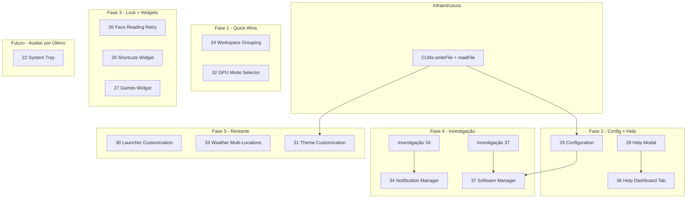

# Sequência de Implementação Recomendada

**Última atualização**: 2026-02-01

Este documento define a ordem recomendada para implementar os planos, considerando dependências técnicas, prioridade de uso e complexidade.

---

## Diagrama de Dependências

---

## Sequência Detalhada

### Fase 1: Quick Wins + Alta Prioridade (sem dependências)

| Ordem | Plano | Tempo | Motivo |
|-------|-------|-------|--------|
| 1 | ~~**24** Workspace Visual Grouping~~ | ~~3-4h~~ | ✅ Implementado |
| 2 | **32** GPU Mode Selector | 6-8h | Resolve HDMI lag; prioridade alta do usuário |

**Total Fase 1**: ~6-8h

---

### Fase 2: Infraestrutura + Configuration + Help

| Ordem | Plano | Tempo | Motivo |
|-------|-------|-------|--------|
| 4 | **29** Configuration | 4-6h | Inclui Passo 0 (CUtils.writeFile); libera nome "Apps" para 37; painel configuráveis do sistema |
| 5 | **28** Help Modal | 2-3h | Fonte keyboard-shortcuts.md; ajuda usuários |
| 6 | **36** Help Dashboard Tab | 3-4h | Usa mesma fonte que 28; implementar logo após para manter consistência |

**Nota**: O Passo 0 de 29 (CUtils.writeFile) beneficia também 31 (Theme). Se for adicionar CUtils.readFile no mesmo ciclo, 31 fica desbloqueado depois.

**Total Fase 2**: ~9-13h

---

### Fase 3: Complementos Lock Screen + Widgets Barra

| Ordem | Plano | Tempo | Motivo |
|-------|-------|-------|--------|
| 7 | **35** Face Reading Retry | 2-4h | Complementa 21 (Lock Screen) já implementado; baixa complexidade |
| 8 | **26** Shortcuts Widget | 6-8h | Widget na barra; independente |
| 9 | **27** Games Widget | 8-10h | Widget na barra; depende de script list-steam-games; pode ser feito em paralelo com 26 |

**Total Fase 3**: ~16-22h

---

### Fase 4: Investigação + Features Complexas

| Ordem | Plano | Tempo | Motivo |
|-------|-------|-------|--------|
| 10 | **Investigação 34** | 2-4h | Obrigatória antes de 34; documentar Quickshell Notifications |
| 11 | **34** Notification Manager | 12-16h | Após investigação; painel complexo |
| 12 | **Investigação 37** | 2-4h | Obrigatória antes de 37; documentar pacman/flatpak/AUR/Snap/AppImage |
| 13 | **37** Software Manager | 15-23h | Após 29 (nome "Apps" livre); após investigação |

**Total Fase 4**: ~31-47h

---

### Fase 5: Restante

| Ordem | Plano | Tempo | Motivo |
|-------|-------|-------|--------|
| 14 | **30** Launcher Customization | 6-8h | Editar ícones/nomes; independente |
| 15 | **33** Weather Multi-Locations | 6-8h | Refatorar Weather service; independente |
| 16 | **31** Theme Customization | 10-15h | Precisa CUtils.readFile + writeFile (writeFile vem do 29); mais complexo |

**Total Fase 5**: ~22-31h

---

## Resumo da Sequência

| # | Plano | Fase | Tempo est. |
|---|-------|------|-------------|
| 1 | ~~24 Workspace Grouping~~ | 1 | ~~3-4h~~ ✅ |
| 2 | ~~32 GPU Mode Selector~~ | 1 | ~~6-8h~~ ✅ |
| 3 | 29 Configuration | 2 | 4-6h |
| 4 | 28 Help Modal | 2 | 2-3h |
| 5 | 36 Help Dashboard Tab | 2 | 3-4h |
| 6 | 35 Face Reading Retry | 3 | 2-4h |
| 7 | 26 Shortcuts Widget | 3 | 6-8h |
| 8 | 27 Games Widget | 3 | 8-10h |
| 9 | Investigação 34 | 4 | 2-4h |
| 10 | 34 Notification Manager | 4 | 12-16h |
| 11 | Investigação 37 | 4 | 2-4h |
| 12 | 37 Software Manager | 4 | 15-23h |
| 13 | 30 Launcher Customization | 5 | 6-8h |
| 14 | 33 Weather Multi-Locations | 5 | 6-8h |
| 15 | 31 Theme Customization | 5 | 10-15h |
| 17 | **22 System Tray** (avaliar por último) | Futuro | A definir |

**Total estimado**: ~88-127h (+ 22 no futuro)

---

## Dependências Críticas

| Plano | Depende de | Observação |
|-------|------------|------------|
| 29 | CUtils.writeFile | Passo 0 incluído no próprio plano |
| 31 | CUtils.readFile + writeFile | writeFile vem do 29; readFile pode ser adicionado junto |
| 34 | Investigação Quickshell Notifications | Passo 0 obrigatório |
| 37 | Investigação software-manager-sources | Passo 0 obrigatório |
| 37 | 29 (opcional) | 29 libera nome "Apps" para o novo pane; não é bloqueante |
| 28, 36 | keyboard-shortcuts.md | Fonte única; criar/sincronizar antes ou durante |

---

## Ajustes Possíveis

- **Paralelizar**: 26 e 27 podem ser feitos em paralelo (diferentes widgets na barra)
- **Antecipar 35**: Face Reading Retry pode subir para Fase 2 (complementa Lock Screen)
- **Adiar 31**: Theme Customization é complexo; pode ficar para v0.3.0+
- **Priorizar 32**: Se HDMI lag for crítico, 32 pode ser o primeiro da Fase 1
- **22 System Tray**: Feature complexa de implementar; avaliar por último no futuro