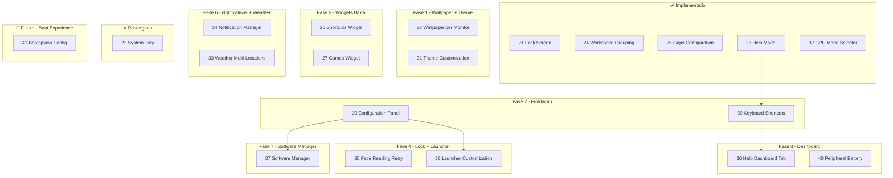

# Sequência de Implementação Recomendada

**Última atualização**: 2026-02-07

Este documento define a ordem recomendada para implementar os planos, considerando dependências técnicas, prioridade de uso e complexidade.

---

## Diagrama de Dependências

---

## Sequência Detalhada

### ✅ Implementado

| Plano | Status | Notas |
|-------|--------|-------|
| **21** Lock Screen Auth Selector | ✅ | Face/PIN selection |
| **24** Workspace Visual Grouping | ✅ | Groups de 5 workspaces |
| **25** Gaps Configuration | ✅ | Inner/outer gaps |
| **28** Help Modal | ✅ | 212 linhas, Super+F1 |
| **32** GPU Mode Selector | ✅ | NVIDIA/Intel toggle |

---

### Fase 1: Wallpaper + Theme (Customização Visual)

| Ordem | Plano | Tempo | Motivo |
|-------|-------|-------|--------|
| 1 | **38** Wallpaper per Monitor | 6-8h | Multi-source + per-monitor; usa FileSystemModel existente; config própria via FileView |
| 2 | **31** Theme Customization | 10-15h | Gerar paleta M3; color picker + preview em tempo real |

**Dependências**:
- 38 usa config própria (WallpaperConfig via FileView); não depende do Configuration Panel
- 31 manipula Colors.qml diretamente; independente de outros planos
- 38 e 31 são independentes entre si e podem ser paralelizados

**Total Fase 1**: ~16-23h

---

### Fase 2: Fundação (Config + Shortcuts)

| Ordem | Plano | Tempo | Motivo |
|-------|-------|-------|--------|
| 3 | **39** Keyboard Shortcuts Management | 8-10h | ShortcutsManager centraliza core+custom; base para Help Tab |
| 4 | **29** Configuration Panel | 6-8h | Painel central de config; usado por vários planos |

**Dependências**:
- 39 usa HelpModal.qml como referência (shortcuts hardcoded → ShortcutsManager)
- 29 estabelece padrão de config que 30, 37 reutilizam

**Total Fase 2**: ~14-18h

---

### Fase 3: Dashboard Enhancements

| Ordem | Plano | Tempo | Motivo |
|-------|-------|-------|--------|
| 5 | **36** Help Dashboard Tab | 3-4h | Reutiliza ShortcutsManager do plano 39 |
| 6 | **40** Peripheral Battery Card | 4-6h | Card independente; usa Bluetooth API existente |

**Dependências**:
- 36 depende de 39 (ShortcutsManager.getCoreByCategory)
- 40 independente (apenas layout do Dashboard)

**Total Fase 3**: ~7-10h

---

### Fase 4: Lock Screen + Launcher

| Ordem | Plano | Tempo | Motivo |
|-------|-------|-------|--------|
| 7 | **35** Face Reading Retry | 4-6h | Complementa Lock Screen; baixa complexidade |
| 8 | **30** Launcher Customization | 6-8h | Editar ícones/nomes de apps; usa Config Panel (29) |

**Dependências**:
- 35 independente
- 30 depende de 29 (Config Panel da fase 2)

**Total Fase 4**: ~10-14h

---

### Fase 5: Widgets na Barra

| Ordem | Plano | Tempo | Motivo |
|-------|-------|-------|--------|
| 9 | **26** Shortcuts Widget | 6-8h | Atalhos rápidos na barra (apps, vaults, etc) |
| 10 | **27** Games Widget | 8-10h | Steam favorites; parsing VDF |

**Nota**: 26 (Shortcuts Widget) ≠ 39 (Keyboard Shortcuts)
- 26 = botões clicáveis na barra para abrir apps
- 39 = atalhos de teclado (Super+X)

**Total Fase 5**: ~14-18h

---

### Fase 6: Notifications + Weather

| Ordem | Plano | Tempo | Motivo |
|-------|-------|-------|--------|
| 11 | **34** Notification Manager | 12-16h | Histórico existe; adicionar blockedApps + iconOverrides |
| 12 | **33** Weather Multi-Locations | 6-8h | Refatorar Weather service |

**Total Fase 6**: ~18-24h

---

### Fase 7: Software Manager

| Ordem | Plano | Tempo | Motivo |
|-------|-------|-------|--------|
| 13 | **37** Software Manager | 15-23h | Listar/atualizar/remover apps (pacman, flatpak, AUR) |

**Total Fase 7**: ~15-23h

---

## Resumo da Sequência

| # | Plano | Fase | Tempo | Status |
|---|-------|------|-------|--------|
| - | 21 Lock Screen | - | - | ✅ Implementado |
| - | 24 Workspace Grouping | - | - | ✅ Implementado |
| - | 25 Gaps Configuration | - | - | ✅ Implementado |
| - | 28 Help Modal | - | - | ✅ Implementado |
| - | 32 GPU Mode Selector | - | - | ✅ Implementado |
| 1 | **38 Wallpaper per Monitor** | 1 | 6-8h | ⏱️ Próximo |
| 2 | **31 Theme Customization** | 1 | 10-15h | ⏱️ Próximo |
| 3 | 39 Keyboard Shortcuts | 2 | 8-10h | ⏱️ Planejado |
| 4 | 29 Configuration Panel | 2 | 6-8h | ⏱️ Planejado |
| 5 | 36 Help Dashboard Tab | 3 | 3-4h | ⏱️ Planejado |
| 6 | 40 Peripheral Battery | 3 | 4-6h | ⏱️ Planejado |
| 7 | 35 Face Reading Retry | 4 | 4-6h | ⏱️ Planejado |
| 8 | 30 Launcher Customization | 4 | 6-8h | ⏱️ Planejado |
| 9 | 26 Shortcuts Widget | 5 | 6-8h | ⏱️ Planejado |
| 10 | 27 Games Widget | 5 | 8-10h | ⏱️ Planejado |
| 11 | 34 Notification Manager | 6 | 12-16h | ⏱️ Planejado |
| 12 | 33 Weather Multi-Locations | 6 | 6-8h | ⏱️ Planejado |
| 13 | 37 Software Manager | 7 | 15-23h | ⏱️ Planejado |
| - | 22 System Tray | Futuro | TBD | ⏳ Bloqueado (sync incubation) |
| - | **41 Bootsplash (config)** | Futuro – Boot | TBD | 🔮 Ver `caelestia-arch-setup/development/docs/13-boot-experience-tbd.md` §1 |

**Total estimado restante**: ~94-130h

---

### 🔮 Fase Futuro — Boot Experience

| Plano | Descrição | Onde está |
|-------|-----------|-----------|
| **41** Bootsplash selecionável | Animação/tema de bootsplash configurável no painel do Caelestia | `development/docs/13-boot-experience-tbd.md` §1 |

Nota: Itens “Lock como primeira tela” e “Menu de boot por tecla” são do sistema (SDDM, bootloader), não do Caelestia Shell; documentados no mesmo doc §2 e §3.

---

## ✅ Validações Técnicas (2026-02-06)

| Item | Status | Notas |
|------|--------|-------|
| FileView.setText() | ✅ | Persistência de config |
| hyprctl keyword bind/unbind | ✅ | Runtime keybindings (testado) |
| Bluetooth.devices.values | ✅ | Lista dispositivos conectados |
| device.battery/batteryAvailable | ✅ | Bateria de BT devices |
| FileSystemModel multi-source | ✅ | Repeater com múltiplos FSM |
| Shape + PathAngleArc | ✅ | Usado em Media.qml (rings) |
| Qt.uuidCreate() | ✅ | Gerar IDs únicos |

---

## Notas de Implementação

### Plano 38 (Wallpaper) — Fase 1
- **Não usa hyprpaper**: Quickshell renderiza direto via QML
- **Multi-source**: Repeater de FileSystemModel
- **Per-monitor**: `Wallpapers.getForMonitor(screen.name)`
- **Config própria**: FileView para persistir wallpaper por monitor

### Plano 31 (Theme Customization) — Fase 1
- **Color picker**: Selecionar cor primária
- **Paleta M3**: Gerar ~50 cores derivadas automaticamente
- **Preview**: Tempo real antes de aplicar
- **Temas salvos**: Persistir temas customizados do usuário

### Plano 39 (Keyboard Shortcuts)
- **Core shortcuts**: Hardcoded no ShortcutsManager (imutáveis)
- **Custom shortcuts**: Persistidos em config.json
- **HelpModal**: Refatorar para usar `ShortcutsManager.getCoreByCategory()`
- **Runtime**: `hyprctl keyword bind/unbind` funciona

### Plano 40 (Peripheral Battery)
- **Dispositivos BT**: `Bluetooth.devices.values.filter(d => d.connected)`
- **Tipos**: Detectar via `device.icon.includes("mouse"|"keyboard"|"headset")`
- **2.4GHz**: Pode precisar UPower (investigação futura)

---

## Ajustes Possíveis

- **Paralelizar 1+2**: Wallpaper e Theme são independentes entre si
- **Paralelizar 5+6**: Help Tab e Peripheral Battery são independentes
- **Paralelizar 9+10**: Shortcuts Widget e Games Widget são independentes
- **Antecipar 40**: Se quiser ver periféricos logo (baixa complexidade)
- **22 System Tray**: Bloqueado por bug de sync incubation; postergado indefinidamente
