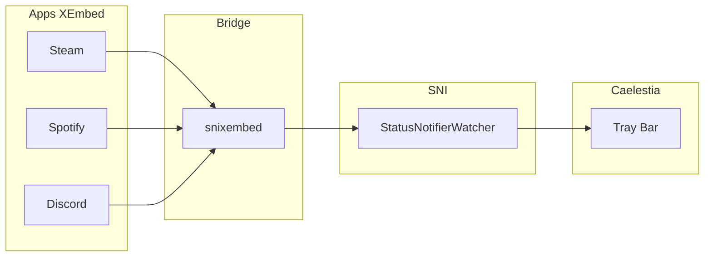

# 🔔 System Tray - Corrigir Ícones (Steam/Spotify)

**ID**: 22  
**Status**: ⏱️ Planejado  
**Complexidade**: 🟢 Baixa  
**Tempo Estimado**: 1-2h

---

## 📋 Resumo

Corrigir o problema de ícones do system tray (Steam, Spotify, Discord) que não aparecem na barra do Caelestia Shell.

---

## 🎯 Problema

### Sintomas

- Steam, Spotify, Discord não aparecem no system tray
- Outros aplicativos (NetworkManager, Bluetooth) aparecem normalmente
- Mensagem nos logs: "StatusNotifierWatcher not running or no items"

### Diagnóstico

```bash
# Verificar StatusNotifierWatcher
qdbus org.kde.StatusNotifierWatcher /StatusNotifierWatcher

# Ver itens registrados
qdbus org.kde.StatusNotifierWatcher /StatusNotifierWatcher \
  org.kde.StatusNotifierWatcher.RegisteredStatusNotifierItems

# Resultado esperado: lista vazia ou sem Steam/Spotify
```

---

## 🔍 Causa Raiz

### Problema: Protocolo XEmbed vs SNI

**Steam, Spotify, Discord usam XEmbed**:
- Protocolo antigo do X11
- Não é nativo do Wayland
- Precisa de adapter (bridge) para funcionar

**Caelestia Shell usa SNI** (StatusNotifierItem):
- Protocolo moderno
- Suportado nativamente no Wayland
- Não entende XEmbed diretamente

### Solução: snixembed

**snixembed** = SNI + XEmbed  
Bridge que converte sinais XEmbed → SNI

### Arquitetura do Fluxo



---

## 🛠️ Solução Proposta

### Opção 1: Instalar snixembed (Recomendado)

**Vantagens**:
- ✅ Funciona para todos os apps XEmbed
- ✅ Não requer mudanças nos apps
- ✅ Solução padrão da comunidade Wayland
- ✅ Baixo overhead

**Passos**:

1. **Instalar snixembed**:
```bash
paru -S snixembed-git
```

2. **Adicionar ao autostart do Hyprland**:
```bash
echo "exec-once = snixembed &" >> ~/.config/hypr/hyprland.conf
```

3. **Reiniciar Hyprland** ou rodar manualmente:
```bash
snixembed &
```

4. **Testar**:
```bash
# Abrir Steam
steam &

# Verificar se apareceu no tray
qdbus org.kde.StatusNotifierWatcher /StatusNotifierWatcher \
  org.kde.StatusNotifierWatcher.RegisteredStatusNotifierItems
```

---

### Opção 2: Forçar Apps a Usar SNI

**Alguns apps suportam SNI, mas usam XEmbed por default**

#### Steam

**Método 1**: Variáveis de ambiente
```bash
# Editar launcher
nano ~/.local/share/applications/steam.desktop

# Modificar linha Exec:
Exec=env GDK_BACKEND=wayland USE_OZONE_WAYLAND=1 steam %U
```

**Método 2**: Flag de início
```bash
steam --enable-features=UseOzonePlatform --ozone-platform=wayland
```

#### Spotify

Spotify usa Electron, que suporta Wayland:
```bash
# Criar wrapper
cat > ~/.local/bin/spotify-wayland << 'EOF'
#!/bin/bash
exec spotify --enable-features=UseOzonePlatform --ozone-platform=wayland "$@"
EOF
chmod +x ~/.local/bin/spotify-wayland

# Editar .desktop
nano ~/.local/share/applications/spotify.desktop
# Exec=spotify-wayland %U
```

**Problema**: Nem sempre funciona, apps podem não implementar SNI corretamente

---

### Opção 3: Verificar Quickshell SNI Host

**Caelestia Shell deve registrar como SNI host**

```bash
# Verificar se Quickshell está registrado
qdbus org.kde.StatusNotifierWatcher /StatusNotifierWatcher \
  org.kde.StatusNotifierWatcher.IsStatusNotifierHostRegistered
# Deve retornar: true
```

Se retornar `false`:
- Bug no Quickshell ou Caelestia
- Reportar issue no upstream

---

## 📂 Arquivos a Modificar

### 1. Scripts de Instalação (caelestia-arch-setup)

**Arquivo**: `scripts/stage2/20-install-packages.sh` (ou similar)

```bash
# Adicionar snixembed aos pacotes AUR
AUR_PACKAGES+=(
    # ... outros pacotes
    "snixembed-git"
)
```

### 2. Config Hyprland

**Arquivo**: `~/.config/hypr/hyprland.conf`

```bash
# System Tray Bridge
exec-once = snixembed
```

### 3. Documentação

**Arquivo**: `docs/20-troubleshooting.md`

Adicionar seção sobre system tray icons (já existe, mas pode expandir)

---

## 🧪 Testes

### Checklist de Validação

- [ ] snixembed instalado: `command -v snixembed`
- [ ] snixembed rodando: `ps aux | grep snixembed`
- [ ] Steam no tray: abrir Steam, verificar ícone
- [ ] Spotify no tray: abrir Spotify, verificar ícone
- [ ] Discord no tray: abrir Discord, verificar ícone
- [ ] StatusNotifierWatcher registra items:
  ```bash
  qdbus org.kde.StatusNotifierWatcher /StatusNotifierWatcher \
    org.kde.StatusNotifierWatcher.RegisteredStatusNotifierItems
  ```

### Casos de Teste

#### Teste 1: Steam

```bash
# 1. Iniciar Steam
steam &

# 2. Aguardar carregar (30s)

# 3. Minimizar janela

# 4. Verificar tray
# Deve aparecer ícone do Steam na barra
```

#### Teste 2: Spotify

```bash
# 1. Iniciar Spotify
spotify &

# 2. Aguardar login

# 3. Minimizar

# 4. Verificar tray
# Deve aparecer ícone do Spotify na barra
```

#### Teste 3: Discord

```bash
# 1. Iniciar Discord
discord &

# 2. Aguardar login

# 3. Minimizar/fechar janela (configurar para minimizar to tray)
# Settings → Windows Settings → Minimize to Tray

# 4. Verificar tray
```

---

## 🐛 Troubleshooting

### snixembed Não Inicia

**Sintomas**:
```bash
ps aux | grep snixembed
# (vazio)
```

**Diagnóstico**:
```bash
# Rodar manualmente para ver erros
snixembed
```

**Causas Comuns**:
- Falta XWayland: `sudo pacman -S xorg-xwayland`
- StatusNotifierWatcher não disponível

---

### Ícones Ainda Não Aparecem

**Sintomas**: snixembed rodando, mas ícones não aparecem

**Diagnóstico**:
```bash
# Ver logs do snixembed
journalctl --user -xe | grep snixembed

# Ver se StatusNotifierWatcher está registrado
qdbus org.kde.StatusNotifierWatcher /StatusNotifierWatcher
```

**Soluções**:

1. **Reiniciar snixembed**:
```bash
killall snixembed
snixembed &
```

2. **Reiniciar apps**:
```bash
killall steam spotify discord
# Reabrir
```

3. **Verificar XWayland**:
```bash
echo $DISPLAY
# Deve mostrar algo como :0 ou :1
```

---

### Ícone Aparece mas Não Clica

**Problema**: Ícone visível, mas cliques não funcionam

**Causa**: Bug no snixembed ou no app

**Workaround**: Usar atalho de teclado do app ou taskbar

---

## 📊 Alternativas (Não Recomendadas)

### waybar

Alguns users usam waybar para tray:
```bash
paru -S waybar
```

Config:
```json
{
  "modules-right": ["tray"],
  "tray": {
    "icon-size": 16,
    "spacing": 10
  }
}
```

**Problema**: Duplica tray (um no Caelestia, outro no waybar)

---

### xembedsniproxy (KDE)

Alternativa do KDE:
```bash
sudo pacman -S xembedsniproxy
```

**Problema**: Dependência pesada (KDE Frameworks)

---

## 📝 Implementação

### Passo 1: Instalar snixembed

```bash
paru -S snixembed-git
```

**Tempo**: ~5 min (depende da build)

---

### Passo 2: Configurar Autostart

```bash
# Editar hyprland.conf
nano ~/.config/hypr/hyprland.conf

# Adicionar linha:
exec-once = snixembed

# Salvar e sair
```

**Tempo**: 1 min

---

### Passo 3: Reiniciar Hyprland

```bash
# Método 1: Logout/Login
hyprctl dispatch exit

# Método 2: Reload config (pode não funcionar)
hyprctl reload

# Método 3: Rodar manualmente (temporário)
snixembed &
```

**Tempo**: 1 min

---

### Passo 4: Testar

```bash
# Abrir Steam/Spotify/Discord
steam &
spotify &
discord &

# Aguardar carregar

# Verificar tray na barra do Caelestia
```

**Tempo**: 5 min

---

### Passo 5: Documentar

Atualizar `docs/20-troubleshooting.md` e `README.md`

**Tempo**: 10 min

---

**Tempo Total**: ~25 min (+ build do snixembed)

---

## ✅ Checklist de Conclusão

- [ ] snixembed instalado
- [ ] Adicionado ao autostart do Hyprland
- [ ] Testado com Steam
- [ ] Testado com Spotify
- [ ] Testado com Discord
- [ ] Documentação atualizada
- [ ] Adicionado ao script de instalação (caelestia-arch-setup)

---

## 🔗 Referências

### snixembed
- **GitHub**: https://git.sr.ht/~steef/snixembed
- **AUR**: https://aur.archlinux.org/packages/snixembed-git

### StatusNotifierItem
- **FreeDesktop Spec**: https://www.freedesktop.org/wiki/Specifications/StatusNotifierItem/
- **Arch Wiki**: https://wiki.archlinux.org/title/Wayland#System_tray

### XEmbed
- **Arch Wiki**: https://wiki.archlinux.org/title/Xembed
- **FreeDesktop**: https://specifications.freedesktop.org/xembed-spec/xembed-spec-latest.html

---

**Próximo**: Após testar, marcar como ✅ no `99-pendencias.md`!
