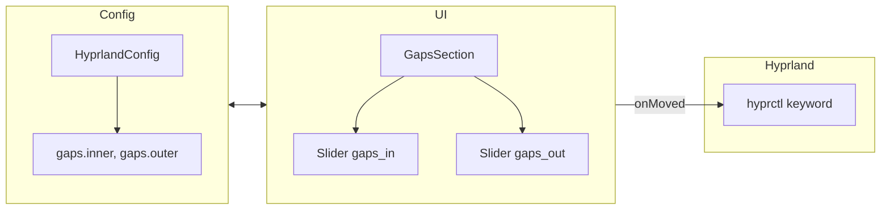
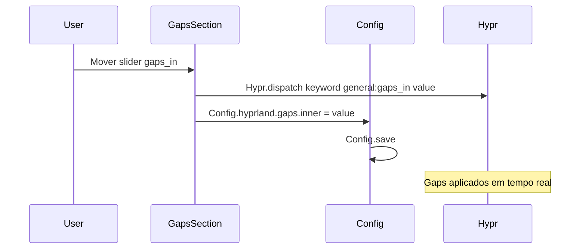

# ⚙️ Gaps Configuration - Configurar via UI

**ID**: 25  
**Status**: ✅ Implementado  
**Complexidade**: 🟡 Média  
**Tempo Estimado**: 3-4h (concluído)

---

## 📋 Resumo

Interface gráfica no Control Center para configurar gaps (espaçamento entre janelas) do Hyprland, aplicando mudanças em tempo real via IPC. **GapsSection** e **HyprlandConfig** já existem no codebase.

---

## 🎯 Objetivos

- Adicionar sliders para `gaps_in` e `gaps_out` no Appearance Pane
- Aplicar mudanças via Hyprland IPC: `hyprctl keyword`
- Persistir valores no hyprland.conf
- Preview em tempo real

---

## 🏗️ Arquitetura

### Fluxo de Aplicação em Tempo Real

---

## 🔧 Gaps do Hyprland

### Config Atual (hyprland.conf)

\`\`\`bash
general {
    gaps_in = 5      # Gap entre janelas
    gaps_out = 20    # Gap entre janela e borda do monitor
    border_size = 2
}
\`\`\`

### Aplicar via IPC

\`\`\`bash
# Mudar gaps em tempo real
hyprctl keyword general:gaps_in 10
hyprctl keyword general:gaps_out 25
\`\`\`

---

## 📂 Arquivos a Criar/Modificar

### 1. Novo: `config/HyprlandConfig.qml`

\`\`\`qml
component HyprlandConfig: JsonObject {
    component Gaps: JsonObject {
        property int inner: 5
        property int outer: 20
    }
    
    property Gaps gaps: Gaps {}
}

property HyprlandConfig hyprland: HyprlandConfig {}
\`\`\`

### 2. Novo: `modules/controlcenter/appearance/sections/GapsSection.qml`

\`\`\`qml
import qs.components
import qs.components.controls
import qs.services
import qs.config
import QtQuick
import QtQuick.Layouts

ColumnLayout {
    spacing: Appearance.spacing.normal
    
    SectionLabel {
        text: qsTr("Window Gaps")
    }
    
    // Inner Gap
    RowLayout {
        StyledText {
            text: qsTr("Inner Gap (between windows)")
            Layout.fillWidth: true
        }
        
        Slider {
            id: innerGapSlider
            from: 0
            to: 30
            stepSize: 1
            value: Config.hyprland.gaps.inner
            
            Layout.preferredWidth: 200
            
            onMoved: {
                // Aplicar via Hyprland IPC
                Hypr.dispatch(\`keyword general:gaps_in \${value}\`)
                Config.hyprland.gaps.inner = value
            }
        }
        
        StyledText {
            text: Math.round(innerGapSlider.value)
            Layout.preferredWidth: 30
        }
    }
    
    // Outer Gap
    RowLayout {
        StyledText {
            text: qsTr("Outer Gap (screen edges)")
            Layout.fillWidth: true
        }
        
        Slider {
            id: outerGapSlider
            from: 0
            to: 50
            stepSize: 1
            value: Config.hyprland.gaps.outer
            
            Layout.preferredWidth: 200
            
            onMoved: {
                // Aplicar via Hyprland IPC
                Hypr.dispatch(\`keyword general:gaps_out \${value}\`)
                Config.hyprland.gaps.outer = value
            }
        }
        
        StyledText {
            text: Math.round(outerGapSlider.value)
            Layout.preferredWidth: 30
        }
    }
    
    // Reset Button
    StyledButton {
        text: qsTr("Reset to Defaults")
        icon: "refresh"
        
        onClicked: {
            innerGapSlider.value = 5
            outerGapSlider.value = 20
        }
    }
}
\`\`\`

### 3. Modificar: `modules/controlcenter/appearance/AppearancePane.qml`

\`\`\`qml
// Adicionar import
import "./sections" as Sections

// Adicionar no layout (linha ~100+)
Sections.GapsSection {
    Layout.fillWidth: true
}
\`\`\`

---

## 🎨 Interface Visual

\`\`\`
┌─────────────────────────────────────────┐
│ Appearance                              │
│                                         │
│ ... (outras seções)                     │
│                                         │
│ Window Gaps                             │
│ ┌─────────────────────────────────────┐ │
│ │ Inner Gap (between windows)         │ │
│ │ [────o──────────────────] 5         │ │
│ │                                     │ │
│ │ Outer Gap (screen edges)            │ │
│ │ [──────────o────────────] 20        │ │
│ │                                     │ │
│ │ [Reset to Defaults]                 │ │
│ └─────────────────────────────────────┘ │
└─────────────────────────────────────────┘
\`\`\`

---

## 🔧 Implementação

### Fase 1: Config (30 min)

\`\`\`bash
# 1. Criar HyprlandConfig.qml
cd config/
nano HyprlandConfig.qml
# (adicionar código acima)

# 2. Importar no Config.qml principal
nano Config.qml
# import "./HyprlandConfig.qml"
# property HyprlandConfig hyprland: HyprlandConfig {}
\`\`\`

### Fase 2: UI Section (1-2h)

\`\`\`bash
# 1. Criar pasta sections (se não existir)
mkdir -p modules/controlcenter/appearance/sections

# 2. Criar GapsSection.qml
nano modules/controlcenter/appearance/sections/GapsSection.qml
# (adicionar código acima)

# 3. Modificar AppearancePane.qml
nano modules/controlcenter/appearance/AppearancePane.qml
# (adicionar import e section)
\`\`\`

### Fase 3: Persistência (1h)

\`\`\`bash
# Script para persistir em hyprland.conf
cat > scripts/apply-gaps.sh << 'EOF'
#!/bin/bash
INNER=\$1
OUTER=\$2

# Aplicar via IPC
hyprctl keyword general:gaps_in \$INNER
hyprctl keyword general:gaps_out \$OUTER

# Persistir em config
CONFIG="~/.config/hypr/hyprland.conf"
sed -i "s/gaps_in = .*/gaps_in = \$INNER/" \$CONFIG
sed -i "s/gaps_out = .*/gaps_out = \$OUTER/" \$CONFIG
EOF
chmod +x scripts/apply-gaps.sh
\`\`\`

---

## 🧪 Testes

- [x] Sliders aparecem no Appearance pane
- [x] Slider inner: 0-30, default 5
- [x] Slider outer: 0-50, default 20
- [x] Mover slider → gaps mudam em tempo real
- [x] Valor numérico atualiza ao lado do slider
- [x] Reset button restaura defaults
- [x] Valores persistem após reiniciar Quickshell
- [x] Valores persistem após reiniciar Hyprland

---

## 🔗 Referências

- **Hyprland Variables**: https://wiki.hyprland.org/Configuring/Variables/#general
- **hyprctl**: https://wiki.hyprland.org/Configuring/Using-hyprctl/
- **Qt Slider**: https://doc.qt.io/qt-6/qml-qtquick-controls-slider.html

---

## ✅ Validações Confirmadas (2026-02-01)

| Item | Decisão |
|------|---------|
| Estado atual | **Revisar e marcar como implementado** — GapsSection e HyprlandConfig já existem |

---

**Status**: Implementado. GapsSection em `modules/controlcenter/appearance/sections/GapsSection.qml`; HyprlandConfig em `config/HyprlandConfig.qml`.
