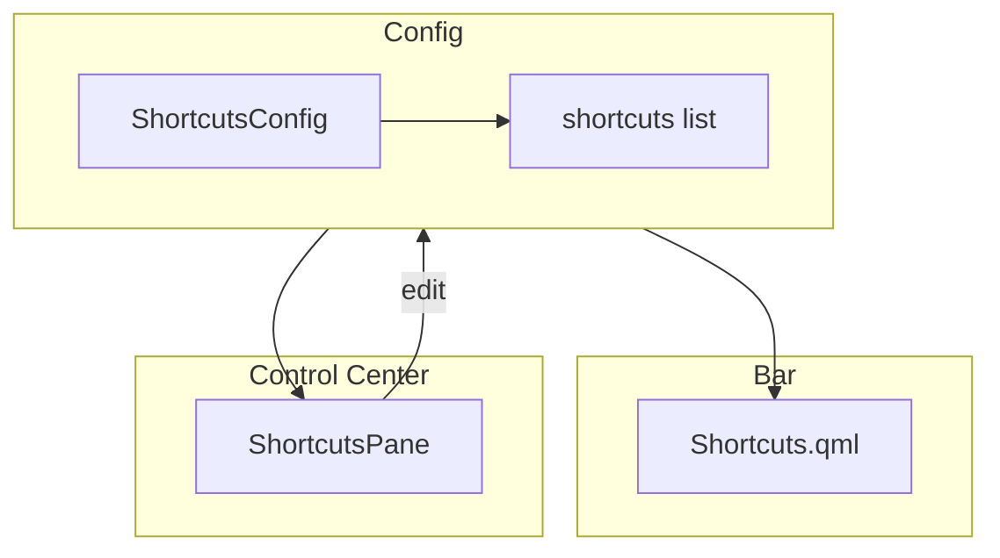

# 🔗 Shortcuts Widget - Atalhos Configuráveis

**ID**: 26  
**Status**: ⏱️ Planejado  
**Complexidade**: 🟡 Média  
**Tempo Estimado**: 6-8h

---

## 📋 Resumo

Widget na barra superior com botões de atalhos configuráveis (ex: vaults do Obsidian, projetos favoritos, etc).

---

## 🎯 Objetivos

- Widget na barra com ícones clicáveis
- Config: nome, ícone, comando
- Painel no Control Center para gerenciar shortcuts
- Persistência em `shell.json`

### Arquitetura

---

## 🎨 Visualização

\`\`\`
Barra Superior:
┌────────────────────────────────────────────┐
│ [Menu] [Workspaces] ... [📁][📝][🎮] [⚙️] │
│                          ↑  ↑  ↑          │
│                      Shortcuts Widget     │
└────────────────────────────────────────────┘
\`\`\`

---

## 📂 Estrutura de Arquivos

### 1. `config/ShortcutsConfig.qml`

> **Padrão**: Usar `list<var>` com objetos JS (igual a `LauncherConfig.actions`)

\`\`\`qml
component ShortcutsConfig: JsonObject {
    property list<var> shortcuts: [
        {
            name: "Vault Personal",
            icon: "folder",
            command: "obsidian obsidian://open?vault=Personal",
            workingDirectory: ""
        },
        {
            name: "Vault Work",
            icon: "work",
            command: "obsidian obsidian://open?vault=Work",
            workingDirectory: ""
        }
    ]
}

property ShortcutsConfig shortcuts: ShortcutsConfig {}
\`\`\`

### 2. `modules/bar/components/Shortcuts.qml`

\`\`\`qml
import qs.components
import qs.services
import qs.config
import QtQuick
import QtQuick.Layouts

RowLayout {
    id: root
    spacing: Appearance.spacing.small
    
    Repeater {
        model: Config.shortcuts.shortcuts
        
        delegate: IconButton {
            icon: modelData.icon
            tooltip: modelData.name
            
            onClicked: {
                if (modelData.workingDirectory !== "") {
                    Quickshell.execDetached([
                        "sh", "-c",
                        \`cd "\${modelData.workingDirectory}" && \${modelData.command}\`
                    ])
                } else {
                    Quickshell.execDetached(["sh", "-c", modelData.command])
                }
            }
        }
    }
}
\`\`\`

### 3. `modules/controlcenter/shortcuts/ShortcutsPane.qml`

\`\`\`qml
ColumnLayout {
    SectionLabel { text: qsTr("Shortcuts") }
    
    // Lista de shortcuts
    Repeater {
        model: Config.shortcuts.shortcuts
        
        delegate: RowLayout {
            MaterialIcon { icon: modelData.icon }
            StyledText { text: modelData.name }
            
            IconButton {
                icon: "edit"
                onClicked: {
                    editDialog.open(index)
                }
            }
            
            IconButton {
                icon: "delete"
                onClicked: {
                    Config.shortcuts.shortcuts.splice(index, 1)
                }
            }
        }
    }
    
    // Botão adicionar
    StyledButton {
        text: qsTr("Add Shortcut")
        icon: "add"
        onClicked: editDialog.open(-1)
    }
    
    // Dialog de edição
    ShortcutEditDialog {
        id: editDialog
    }
}
\`\`\`

---

## 🔧 Implementação

1. Criar `ShortcutsConfig.qml` (30 min)
2. Criar `Shortcuts.qml` widget (1h)
3. Integrar na barra (30 min)
4. Criar `ShortcutsPane.qml` (2-3h)
5. Dialog de edição (2h)
6. Testes (1h)

**Total**: 6-8h

---

## 🧪 Testes

- [ ] Shortcuts aparecem na barra
- [ ] Clicar executa comando
- [ ] Tooltip mostra nome
- [ ] Adicionar shortcut via UI
- [ ] Editar shortcut existente
- [ ] Remover shortcut
- [ ] Persistência funciona

---

## ✅ Validações Confirmadas (2026-02-05)

| Item | Decisão |
|------|---------|
| Config list | Usar `list<var>` com objetos JS (padrão do codebase) |
| Execução | `Quickshell.execDetached()` (confirmado em shell.qml:78) |
| Referência | `config/LauncherConfig.qml:32` — padrão idêntico para `actions` |

---

**Ver também**: `28-help-modal.md` (similar em estrutura)
