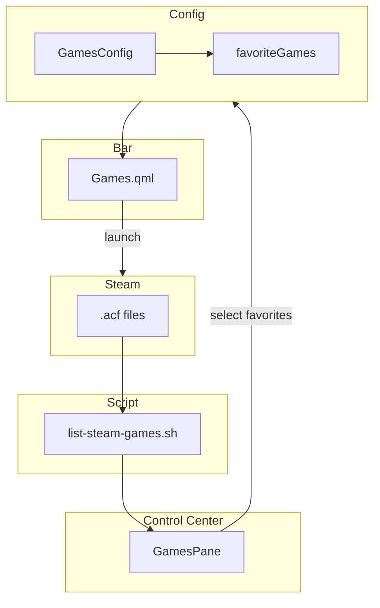

# 🎮 Games Widget - Jogos Steam Favoritos

**ID**: 27  
**Status**: ⏱️ Planejado  
**Complexidade**: 🟡 Média  
**Tempo Estimado**: 8-10h

---

## 📋 Resumo

Widget na barra com jogos Steam favoritos, permitindo launch rápido.

---

## 🎯 Objetivos

- Listar jogos instalados (parse `.acf` da Steam)
- Widget na barra com jogos favoritos
- Painel no Control Center para selecionar favoritos
- Ícones via Steam CDN

### Arquitetura

---

## 🔍 Listar Jogos Steam

### Localização dos Manifests

\`\`\`bash
~/.steam/steam/steamapps/appmanifest_*.acf
\`\`\`

### Formato VDF (Valve Data Format)

> **IMPORTANTE**: Arquivos `.acf` usam formato VDF, **NÃO é JSON**.

\`\`\`vdf
"AppState"
{
        "appid"         "228980"
        "name"          "Steamworks Common Redistributables"
        "installdir"            "Steamworks Shared"
        ...
}
\`\`\`

### Script de Parsing

\`\`\`bash
#!/bin/bash
# scripts/list-steam-games.sh
# Output: JSON array de jogos instalados

STEAMAPPS="${HOME}/.steam/steam/steamapps"

echo "["
first=true

for acf in "${STEAMAPPS}"/appmanifest_*.acf; do
    [ -f "$acf" ] || continue
    
    # Parse VDF com grep (appid e name estão em linhas separadas)
    appid=$(grep -oP '^\s*"appid"\s*"\K[^"]+' "$acf")
    name=$(grep -oP '^\s*"name"\s*"\K[^"]+' "$acf")
    
    # Skip se não tem nome (ex: redistributables)
    [ -z "$name" ] && continue
    # Skip redistributables
    [[ "$name" == *"Redistributables"* ]] && continue
    
    if [ "$first" = true ]; then
        first=false
    else
        echo ","
    fi
    
    # Escape aspas no nome
    name_escaped=$(echo "$name" | sed 's/"/\\"/g')
    
    printf '  {"appId": "%s", "name": "%s"}' "$appid" "$name_escaped"
done

echo ""
echo "]"
\`\`\`

**Teste do script:**
\`\`\`bash
chmod +x scripts/list-steam-games.sh
./scripts/list-steam-games.sh | jq .
\`\`\`

---

## 📂 Estrutura de Arquivos

### 1. `config/GamesConfig.qml`

> **Padrão**: Usar `list<var>` com objetos JS (igual a `LauncherConfig.actions`)

\`\`\`qml
component GamesConfig: JsonObject {
    property list<var> favoriteGames: [
        // Exemplo:
        // { appId: "730", name: "Counter-Strike 2" }
    ]
}

property GamesConfig games: GamesConfig {}
\`\`\`

### 2. `services/SteamGames.qml` (Novo)

> **Padrão**: Process + StdioCollector para rodar script (igual a `KbLayoutModel.qml`)

\`\`\`qml
pragma Singleton
import Quickshell
import QtQuick
import qs.config

QtObject {
    id: root
    
    property list<var> installedGames: []
    property bool loading: false
    
    function reload() {
        loading = true
        listProcess.running = true
    }
    
    Process {
        id: listProcess
        command: ["bash", Paths.scriptPath("list-steam-games.sh")]
        
        stdout: StdioCollector {
            onStreamFinished: {
                try {
                    root.installedGames = JSON.parse(text)
                } catch (e) {
                    console.error("Failed to parse Steam games:", e)
                    root.installedGames = []
                }
                root.loading = false
            }
        }
    }
    
    Component.onCompleted: reload()
}
\`\`\`

### 3. `modules/bar/components/Games.qml`

\`\`\`qml
import qs.services
import qs.config
import QtQuick
import QtQuick.Layouts

RowLayout {
    id: root
    spacing: Appearance.spacing.small
    
    visible: Config.games.favoriteGames.length > 0
    
    Repeater {
        model: Config.games.favoriteGames
        
        delegate: IconButton {
            required property var modelData
            
            // Ícone via Steam CDN (header = 460x215, icon = 32x32)
            Image {
                anchors.centerIn: parent
                width: 24
                height: 24
                source: "https://cdn.cloudflare.steamstatic.com/steam/apps/" + modelData.appId + "/capsule_231x87.jpg"
                fillMode: Image.PreserveAspectCrop
            }
            
            tooltip: modelData.name
            
            onClicked: {
                Quickshell.execDetached(["steam", "steam://run/" + modelData.appId])
            }
        }
    }
}
\`\`\`

### 4. `modules/controlcenter/games/GamesPane.qml`

\`\`\`qml
import qs.services
import qs.config
import QtQuick
import QtQuick.Layouts

ColumnLayout {
    id: root
    
    SectionLabel { text: qsTr("Favorite Games") }
    
    // Loading indicator
    StyledText {
        visible: SteamGames.loading
        text: qsTr("Loading Steam games...")
    }
    
    // Lista jogos instalados
    Repeater {
        model: SteamGames.installedGames
        
        delegate: RowLayout {
            required property var modelData
            required property int index
            
            CheckBox {
                checked: Config.games.favoriteGames.some(g => g.appId === modelData.appId)
                
                onToggled: {
                    var favorites = [...Config.games.favoriteGames]
                    var idx = favorites.findIndex(g => g.appId === modelData.appId)
                    
                    if (checked && idx === -1) {
                        favorites.push({ appId: modelData.appId, name: modelData.name })
                    } else if (!checked && idx !== -1) {
                        favorites.splice(idx, 1)
                    }
                    
                    Config.games.favoriteGames = favorites
                }
            }
            
            Image {
                width: 32
                height: 32
                source: "https://cdn.cloudflare.steamstatic.com/steam/apps/" + modelData.appId + "/capsule_231x87.jpg"
                fillMode: Image.PreserveAspectCrop
            }
            
            StyledText {
                text: modelData.name
                Layout.fillWidth: true
            }
        }
    }
    
    // Botão refresh
    StyledButton {
        text: qsTr("Refresh")
        icon: "refresh"
        onClicked: SteamGames.reload()
    }
}
\`\`\`

---

## 🔧 Implementação

1. Criar script `list-steam-games.sh` (30 min)
2. Testar script: `./scripts/list-steam-games.sh | jq .` (10 min)
3. Criar `services/SteamGames.qml` singleton (1h)
4. Criar `config/GamesConfig.qml` e registrar em Config (30 min)
5. Criar `Games.qml` widget na barra (1h)
6. Integrar widget na barra (30 min)
7. Criar `GamesPane.qml` no Control Center (2-3h)
8. Registrar pane em PaneRegistry (15 min)
9. Testes (1h)

**Total**: 8-10h

---

## 🧪 Testes

- [ ] Script lista jogos corretamente (JSON válido)
- [ ] SteamGames.qml carrega lista
- [ ] Jogos aparecem no pane
- [ ] Adicionar/remover de favoritos funciona
- [ ] Widget mostra favoritos na barra
- [ ] Clicar lança jogo via Steam
- [ ] Ícones carregam do CDN
- [ ] Persistência em shell.json

---

## ✅ Validações Confirmadas (2026-02-05)

| Item | Decisão |
|------|---------|
| Formato .acf | VDF (Valve Data Format), não JSON — requer parsing especial |
| Config list | Usar `list<var>` com objetos JS |
| Service | Singleton `SteamGames.qml` com Process + StdioCollector |
| Execução | `Quickshell.execDetached()` para launch |
| Referência | `modules/bar/popouts/kblayout/KbLayoutModel.qml` — padrão Process + StdioCollector |

---

**Desafio resolvido**: Parsing de VDF via grep com regex
