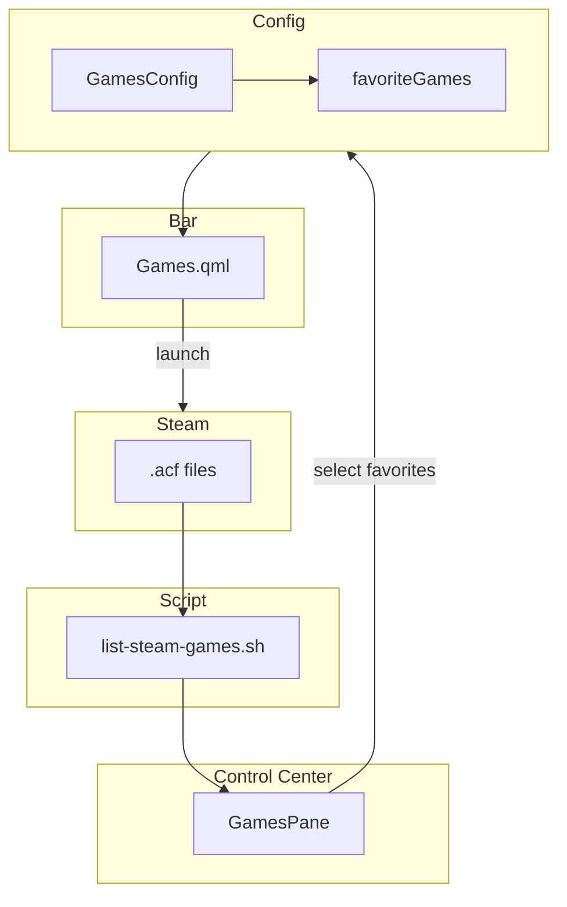

# 🎮 Games Widget - Jogos Steam Favoritos

**ID**: 27  
**Status**: ⏱️ Planejado  
**Complexidade**: 🟡 Média  
**Tempo Estimado**: 8-10h

---

## 📋 Resumo

Widget na barra com jogos Steam favoritos, permitindo launch rápido.

---

## 🎯 Objetivos

- Listar jogos instalados (parse `.acf` da Steam)
- Widget na barra com jogos favoritos
- Painel no Control Center para selecionar favoritos
- Ícones via Steam CDN

### Arquitetura

---

## 🔍 Listar Jogos Steam

### Localização dos Manifests

\`\`\`bash
~/.steam/steam/steamapps/*.acf
\`\`\`

### Parse de .acf

\`\`\`bash
#!/bin/bash
# scripts/list-steam-games.sh

for acf in ~/.steam/steam/steamapps/*.acf; do
    appid=\$(grep '"appid"' "\$acf" | cut -d'"' -f4)
    name=\$(grep '"name"' "\$acf" | cut -d'"' -f4)
    echo "\$appid|\$name"
done
\`\`\`

---

## 📂 Estrutura de Arquivos

### 1. `config/GamesConfig.qml`

\`\`\`qml
component GamesConfig: JsonObject {
    component Game: JsonObject {
        property string appId: ""
        property string name: ""
    }
    
    property list<Game> favoriteGames: []
}

property GamesConfig games: GamesConfig {}
\`\`\`

### 2. `modules/bar/components/Games.qml`

\`\`\`qml
RowLayout {
    Repeater {
        model: Config.games.favoriteGames
        
        delegate: IconButton {
            // Ícone via Steam CDN
            icon.source: \`https://cdn.cloudflare.steamstatic.com/steam/apps/\${modelData.appId}/header.jpg\`
            tooltip: modelData.name
            
            onClicked: {
                Quickshell.execDetached(["steam", \`steam://run/\${modelData.appId}\`])
            }
        }
    }
}
\`\`\`

### 3. `modules/controlcenter/games/GamesPane.qml`

\`\`\`qml
ColumnLayout {
    SectionLabel { text: qsTr("Favorite Games") }
    
    // Lista jogos instalados (via script)
    Process {
        id: steamGames
        command: ["bash", Paths.scriptPath("list-steam-games.sh")]
        running: true
    }
    
    Repeater {
        model: steamGames.output.split("\\n")
        
        delegate: CheckBox {
            text: modelData.split("|")[1]  // Nome
            checked: {
                var appId = modelData.split("|")[0]
                return Config.games.favoriteGames.some(g => g.appId === appId)
            }
            
            onToggled: {
                // Adicionar/remover de favoritos
            }
        }
    }
}
\`\`\`

---

## 🔧 Implementação

1. Script para listar jogos (30 min)
2. `GamesConfig.qml` (30 min)
3. `Games.qml` widget (2h)
4. `GamesPane.qml` (3-4h)
5. Parse e favoritos (2h)
6. Testes (1h)

**Total**: 8-10h

---

## 🧪 Testes

- [ ] Script lista jogos corretamente
- [ ] Jogos aparecem no pane
- [ ] Adicionar a favoritos
- [ ] Widget mostra favoritos
- [ ] Clicar lança jogo via Steam
- [ ] Ícones carregam corretamente

---

**Desafio**: Parse de .acf (formato não é JSON puro)
