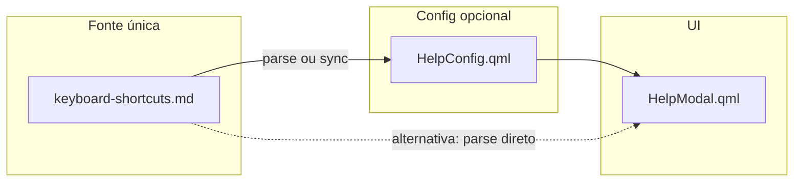

# ❓ Help Modal - Keyboard Shortcuts

**ID**: 28  
**Status**: ⏱️ Planejado  
**Complexidade**: 🟡 Média  
**Tempo Estimado**: 2-3h

---

## 📋 Resumo

Modal com lista de atalhos de teclado disponíveis no sistema.

---

## 🎯 Objetivos

- Modal popup com lista categorizada de shortcuts
- Atalho para abrir: Super+F1
- Atalho para fechar: Super+F1
- Botão no Control Center ou barra

---

## 🎨 Visualização

\`\`\`
┌──────────────────────────────────────┐
│ Keyboard Shortcuts              [✕] │
├──────────────────────────────────────┤
│                                      │
│ System                               │
│ ┌──────────────────────────────────┐ │
│ │ Super+L      Lock screen         │ │
│ │ Super+Q      Quit app            │ │
│ │ Super+Shift+Q Logout            │ │
│ └──────────────────────────────────┘ │
│                                      │
│ Windows                              │
│ ┌──────────────────────────────────┐ │
│ │ Super+F      Toggle float        │ │
│ │ Super+M      Toggle maximize     │ │
│ └──────────────────────────────────┘ │
│                                      │
│ Workspaces                           │
│ ┌──────────────────────────────────┐ │
│ │ Super+1-9    Switch workspace    │ │
│ └──────────────────────────────────┘ │
│                                      │
└──────────────────────────────────────┘
\`\`\`

---

## 🏗️ Arquitetura

---

## 📂 Estrutura

### 1. Fonte única: `keyboard-shortcuts.md`

**Validação (2026-02-01)**: Usar `docs/advanced/keyboard-shortcuts.md` (ou equivalente no caelestia-shell-pereiraoc-patch) como **fonte única de verdade** para o conteúdo dos atalhos. Help Modal (28) e Help Dashboard Tab (36) devem ler desse arquivo ou de estrutura derivada dele.

### 2. `config/HelpConfig.qml` (opcional — ou parse do .md)

\`\`\`qml
component HelpConfig: JsonObject {
    component Category: JsonObject {
        property string name: ""
        property list<Shortcut> shortcuts: []
    }
    
    component Shortcut: JsonObject {
        property string keys: ""
        property string description: ""
    }
    
    property list<Category> categories: [
        Category {
            name: "System"
            shortcuts: [
                Shortcut { keys: "Super+L"; description: "Lock screen" },
                Shortcut { keys: "Super+Q"; description: "Quit app" }
            ]
        },
        Category {
            name: "Windows"
            shortcuts: [
                Shortcut { keys: "Super+F"; description: "Toggle float" }
            ]
        }
    ]
}
\`\`\`

### 3. `modules/help/HelpModal.qml`

\`\`\`qml
Popup {
    id: root
    anchors.centerIn: parent
    width: 600
    height: 700
    
    ColumnLayout {
        anchors.fill: parent
        
        // Header
        RowLayout {
            StyledText {
                text: qsTr("Keyboard Shortcuts")
                font.pixelSize: 24
            }
            
            Item { Layout.fillWidth: true }
            
            IconButton {
                icon: "close"
                onClicked: root.close()
            }
        }
        
        // Scrollable content
        ScrollView {
            Layout.fillWidth: true
            Layout.fillHeight: true
            
            ColumnLayout {
                Repeater {
                    model: Config.help.categories
                    
                    delegate: ColumnLayout {
                        SectionLabel { text: modelData.name }
                        
                        Repeater {
                            model: modelData.shortcuts
                            
                            delegate: RowLayout {
                                StyledText {
                                    text: modelData.keys
                                    font.bold: true
                                    Layout.preferredWidth: 150
                                }
                                
                                StyledText {
                                    text: modelData.description
                                }
                            }
                        }
                    }
                }
            }
        }
    }
}
\`\`\`

### 4. Shortcut para Abrir

\`\`\`qml
// Em modules/Shortcuts.qml ou shell.qml

CustomShortcut {
    name: "help"
    description: "Show keyboard shortcuts"
    sequence: "Super+Slash"  // Super+?
    
    onPressed: helpModal.open()
}

HelpModal {
    id: helpModal
}
\`\`\`

---

## 🔧 Implementação

1. `HelpConfig.qml` (30 min)
2. `HelpModal.qml` (1-1.5h)
3. Shortcut para abrir (15 min)
4. Popular shortcuts (30 min)
5. Testes (30 min)

**Total**: 2-3h

---

## 🧪 Testes

- [ ] Super+? abre modal
- [ ] Modal mostra categorias
- [ ] Shortcuts listados corretamente
- [ ] Scroll funciona
- [ ] Fechar com X ou Esc

---

## ✅ Validações Confirmadas (2026-02-01)

| Item | Decisão |
|------|---------|
| Fonte de shortcuts | **keyboard-shortcuts.md** (arquivo em docs) como fonte única |

---

**Referência**: Inspirado em modais do GNOME/KDE
