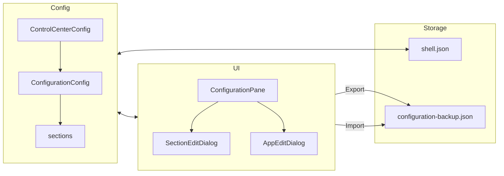
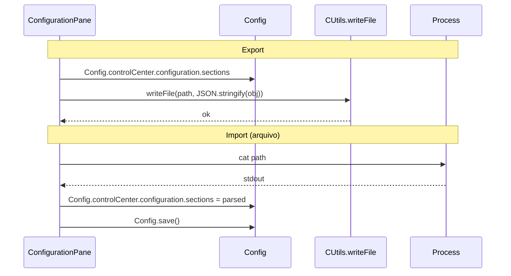

# 🔧 Configuration - Painel Configurável

**ID**: 29  
**Status**: ⏱️ Planejado  
**Complexidade**: 🟡 Média  
**Tempo Estimado**: 8-12h

---

## 📋 Resumo

Painel **"Configuration"** no Control Center totalmente configurável: seções e botões editáveis (nome, ícone, comando) para ferramentas do sistema (Audio, Display, Hardware, etc.), com export/import da configuração. Migra a lista hardcoded atual para dados em `shell.json`.

**Renomeação (2026-02)**: A seção anteriormente chamada "Apps" passa a se chamar **"Configuration"** — reflete melhor o propósito (configuráveis do sistema, não gerenciamento de pacotes).

---

## 🎯 Objetivos

- Painel categorizado (Audio, Display, System, Hardware, Share) com dados em Config
- Botões editáveis: adicionar, editar, remover seções e apps
- Sem filtro `command -v` na primeira versão (mostrar todos os apps configurados; usuário remove manualmente)
- Export: apenas backup em path fixo (configuration-backup.json via CUtils.writeFile)
- Import: carregar de arquivo (Process async) ou colar do clipboard
- Pendência documentada: mapear comandos para "Keyboard config" e "Mouse config"

---

## ✅ Confirmações Técnicas (verificadas no codebase)

| Item | Status | Fonte |
|------|--------|-------|
| `Quickshell.clipboardText` (leitura e escrita) | ✅ | `qmlglobal.hpp` - READ/WRITE |
| `Quickshell.execDetached(command)` para launch | ✅ | Usado em AppsPane.qml atual |
| FileDialog retorna path via `accepted(path)` | ✅ | `components/filedialog/FileDialog.qml`, `DialogButtons.qml` |
| Config usa serializeConfig() manual + JsonAdapter para load | ✅ | `Config.qml` - save via Timer+setText, load via JsonAdapter |
| JsonAdapter suporta `list<var>` em JsonObject aninhado | ✅ | `jsonadapter.cpp` linha 247 - else branch; LauncherConfig.actions similar |
| ControlCenterConfig existe e é minimal | ✅ | Apenas `sizes`; podemos adicionar `configuration` |
| AppsPane atual: `appCategories` hardcoded, usa `modelData.apps` | ✅ | Migrar para `modelData.buttons`; renomear pane para "Configuration" |

---

## ⚠️ Pontos de Atenção / Vulnerabilidades

| Item | Risco | Mitigação |
|------|-------|-----------|
| **Quickshell NÃO tem execSync** | **CRÍTICO** | Quickshell só tem `execDetached` e `Process` (async). Import de arquivo deve usar `Process` + `StdioCollector` + callback (padrão Nmcli). Ver Passo 8. |
| Clipboard vazio no Wayland sem foco | N/A | Export apenas para backup (path fixo); não usa clipboard |
| Import de JSON malformado | Médio | try/catch + Toaster.toast com erro; validar estrutura antes de aplicar |
| Export para arquivo | Resolvido | Adicionar `CUtils.writeFile(path, content)` no plugin (Passo 0); usar path fixo para backup. |
| FileDialog atual: seleciona arquivo existente, não "Save As" | N/A | Export usa path fixo; FileDialog apenas para Import |
| `command -v`: sem execSync, seria Process async por botão | Alto | Omitir filtro de instalação na primeira versão; adicionar depois se necessário |
| Edição inline: mutar `Config.controlCenter.configuration.sections` | Médio | Reatribuir cópia inteira; chamar `Config.save()` após edição |

---

## 🏗️ Arquitetura



### Estrutura em shell.json

```json
{
  "controlCenter": {
    "sizes": { "heightMult": 0.7, "ratio": 1.78 },
    "configuration": {
      "sections": [
        {
          "name": "Audio",
          "icon": "graphic_eq",
          "buttons": [
            {
              "name": "qpwgraph",
              "icon": "cable",
              "command": ["qpwgraph"],
              "description": "PipeWire Graph Manager"
            }
          ]
        }
      ]
    }
  }
}
```

### Formato JSON para Export/Import (standalone)

```json
{
  "version": 1,
  "configuration": {
    "sections": [
      {
        "name": "Audio",
        "icon": "graphic_eq",
        "buttons": [
          {
            "name": "qpwgraph",
            "icon": "cable",
            "command": ["qpwgraph"],
            "description": "PipeWire Graph Manager"
          }
        ]
      }
    ]
  }
}
```

---

## 📂 Arquivos Afetados

| Arquivo | Ação |
|---------|------|
| `plugin/src/Caelestia/cutils.hpp` | Adicionar `Q_INVOKABLE bool writeFile(const QUrl& path, const QString& content)` |
| `plugin/src/Caelestia/cutils.cpp` | Implementar `writeFile` (~20 linhas) |
| `config/ControlCenterConfig.qml` | Adicionar `property ConfigurationConfig configuration: ConfigurationConfig {}` |
| `config/ConfigurationConfig.qml` | Criar (novo) - `property list<var> sections` |
| `config/Config.qml` | Adicionar `serializeControlCenter()` incluir `configuration`, garantir adapter parse |
| `modules/controlcenter/PaneRegistry.qml` | Renomear pane `apps` → `configuration` (id, label) |
| `modules/controlcenter/configuration/ConfigurationPane.qml` | Renomear de apps/AppsPane; ler de Config, UI edição, Export/Import |
| `modules/controlcenter/configuration/SectionEditDialog.qml` | Criar (novo) |
| `modules/controlcenter/configuration/AppEditDialog.qml` | Criar (novo) |
| `docs/99-pendencias.md` | Adicionar item "Keyboard/Mouse config commands" |

---

## 📋 Passo a Passo de Implementação

### Passo 0: CUtils.writeFile (pré-requisito, ~30min)

1. Em `plugin/src/Caelestia/cutils.hpp`: adicionar `Q_INVOKABLE bool writeFile(const QUrl& path, const QString& content) const;`
2. Em `plugin/src/Caelestia/cutils.cpp`: implementar:
   - Validar `path.isLocalFile()` (como em `copyFile`)
   - `QDir().mkpath(QFileInfo(path.toLocalFile()).absolutePath())` para criar diretório se não existir
   - `QFile::open(WriteOnly)` + `file.write(content.toUtf8())`
   - Retornar `true` em sucesso, `false` em falha
3. Função reutilizável para outros exports (tema, shortcuts, etc.)

### Passo 1: ConfigurationConfig.qml (1h)

1. Criar `config/ConfigurationConfig.qml`:
   - `import Quickshell.Io`
   - `JsonObject { property list<var> sections: [...] }`
   - Valor default: migrar `appCategories` atual de `AppsPane.qml` (Audio, Display, System, Hardware, Share) com os mesmos botões
2. Cada seção: `{ name, icon, buttons: [{ name, icon, command, description }] }`
3. Cada botão: `command` é `list<string>` (array para execDetached)

### Passo 2: Integrar ConfigurationConfig em ControlCenterConfig (30min)

1. Em `ControlCenterConfig.qml`: adicionar `property ConfigurationConfig configuration: ConfigurationConfig {}`
2. Em `Config.qml`:
   - Em `serializeControlCenter()`: incluir `configuration: { sections: Config.controlCenter.configuration.sections }`
   - O JsonAdapter já faz parse automático quando a chave `configuration` existir no JSON sob `controlCenter`
3. Garantir que `Config.controlCenter` no adapter tenha a property `configuration` populada pelo parse

### Passo 3: Migrar para ConfigurationPane e ler de Config (1h)

1. Renomear `apps/AppsPane.qml` → `configuration/ConfigurationPane.qml`; atualizar PaneRegistry para `component: "configuration/ConfigurationPane.qml"`
2. Em `ConfigurationPane.qml`:
   - Remover `readonly property var appCategories`
   - Usar `model: Config.controlCenter.configuration.sections` no Repeater externo
   - **Mudar delegate interno**: `model: categoryDelegate.modelData.apps` → `model: categoryDelegate.modelData.buttons` (estrutura usa `buttons`, não `apps`)
   - Manter layout e comportamento de clique (execDetached)
2. **Omitir** filtro `command -v` na primeira versão (exigiria Process async por botão; adicionar em follow-up se necessário)

### Passo 4: SectionEditDialog.qml (1–2h)

1. Criar `modules/controlcenter/configuration/SectionEditDialog.qml`
2. Props: `section: var` (objeto a editar), `onAccepted: function(editedSection)`, `onRejected`
3. Campos: nome (StyledTextField), ícone (MaterialIcon name ou StyledTextField)
4. Botões: OK (emitir editedSection), Cancel
5. **Verificar padrão** em LauncherPane e AppearancePane antes de implementar; usar Popup ou StyledWindow conforme o padrão encontrado

### Passo 5: AppEditDialog.qml (1–2h)

1. Criar `modules/controlcenter/configuration/AppEditDialog.qml`
2. Props: `button: var`, `onAccepted: function(editedButton)`, `onRejected`
3. Campos: name, icon, command (string que será split por espaço em array), description
4. Validação: command não vazio
5. Botões: OK, Cancel

### Passo 6: UI de edição no ConfigurationPane (2–3h)

1. Header do painel:
   - Botão "Export to backup" (path fixo configuration-backup.json via CUtils.writeFile) (ícone `save` ou `backup`)
   - Botão "Import" (FileDialog + Process async para arquivo; clipboard) (ícone `folder_open` ou `download`)
   - Botão "Adicionar seção" (ícone `add`)
2. Por seção:
   - Ícone "editar" (chamar SectionEditDialog)
   - Ícone "adicionar app" (abrir AppEditDialog com button vazio, ao confirmar: push em `section.buttons`)
   - Ícone "remover seção" (confirmar e splice da lista)
3. Por botão:
   - Ícone "editar" (AppEditDialog)
   - Ícone "remover" (splice do array buttons)
4. Após qualquer mutação: reatribuir a lista inteira para garantir que Config detecte a mudança:
   - `var copy = JSON.parse(JSON.stringify(Config.controlCenter.configuration.sections));`
   - Modificar `copy` (push, splice, etc.)
   - `Config.controlCenter.configuration.sections = copy;`
   - `Config.save()`

### Fluxo Export/Import



### Passo 7: Export (1–2h)

1. **Export para backup** (path fixo, via CUtils.writeFile do Passo 0) — única opção de export na primeira versão:
   - Botão "Export to backup" ou similar
   - `const obj = { version: 1, configuration: { sections: Config.controlCenter.configuration.sections } };`
   - `const path = Paths.config + "/configuration-backup.json"; const ok = CUtils.writeFile(Qt.resolvedUrl("file://" + path), JSON.stringify(obj, null, 2));` (referência: CUtils.copyFile em Wrapper.qml)
   - Toaster: sucesso ("Configuration saved to configuration-backup.json") ou erro
   - Path: `~/.config/caelestia/configuration-backup.json` (ou `Paths.config + "/configuration-backup.json"`)
2. **Extensão futura**: Export para clipboard ou FileDialog para escolher destino.

### Passo 8: Import (1–2h)

1. **Import de clipboard**:
   - Botão "Import from clipboard"
   - `const text = Quickshell.clipboardText`
   - `const parsed = JSON.parse(text)`
   - Validar: `parsed.configuration?.sections` é array
   - `Config.controlCenter.configuration.sections = parsed.configuration.sections`
   - `Config.save()`
   - Toaster: "Apps config imported"
2. **Import de arquivo** (usar Process async — Quickshell não tem execSync):
   - FileDialog: `title: "Select configuration backup"`, `filters: ["json"]` ou `["*"]`
   - `onAccepted: path => { criar Process com command ["cat", path], stdout: StdioCollector, onExited: ler stdoutCollector.text, parse, validar, aplicar }`
   - Padrão: igual ao `CommandProcess` em `Nmcli.qml` (Process + StdioCollector + callback em onExited)
   - Mesma validação e aplicação do clipboard
   - Tratar erro: JSON inválido, estrutura incorreta → Toaster com mensagem

### Passo 9: Documentar pendência Keyboard/Mouse (15min)

1. Em `docs/99-pendencias.md`: adicionar item
   - "Mapear comandos para Keyboard config (OpenRGB? gnome-control-center?) e Mouse config (Polychromatic? gnome-control-center?)"
2. Na lista default de seções, incluir "Keyboard" e "Mouse" com `command: ["true"]` ou placeholder até definição

---

## 🧪 Casos de Teste

| Cenário | Ação | Resultado esperado |
|---------|------|--------------------|
| Apps instalados | Abrir painel Apps | Botões visíveis, clique abre app |
| App não instalado (sem filtro) | - | Botão aparece; usuário remove manualmente |
| Editar seção | Clicar editar, mudar nome, OK | Nome atualizado, Config.save() chamado |
| Adicionar app | Clicar adicionar app, preencher, OK | Novo botão na seção |
| Remover app | Clicar remover | Botão some, Config salvo |
| Export backup | Clicar Export to backup | Arquivo configuration-backup.json criado, toast |
| Import clipboard | Colar JSON válido, Import | Seções atualizadas |
| Import arquivo | Selecionar .json válido | Idem |
| Import JSON inválido | Colar lixo | Toast de erro, config inalterada |

---

## 🔗 Referências

- qpwgraph: https://github.com/rncbc/qpwgraph
- EasyEffects: https://github.com/wwmm/easyeffects
- nwg-displays: https://github.com/nwg-piotr/nwg-displays
- LocalSend: https://localsend.org/
- Quickshell JsonAdapter: `quickshell-patched/src/io/jsonadapter.cpp`
- LauncherConfig.actions: exemplo de `list<var>` em Config

---

## Pendências Mapeadas

| Item | Status | Ação |
|------|--------|------|
| Keyboard config | Pendente | Mapear comando (OpenRGB, gnome-control-center region, outro) |
| Mouse config | Pendente | Mapear comando (Polychromatic, gnome-control-center mouse, outro) |

---

## ✅ Validações Confirmadas (2026-02-01)

| Item | Decisão |
|------|---------|
| Export | Apenas backup (path fixo); sem clipboard na primeira versão |
| Import arquivo | Process async (padrão Nmcli) |
| Filtro command -v | Sem filtro na primeira versão |
| Estrutura | Usar `buttons` (migrar de `apps`) |
| Dialogs | Verificar padrão em LauncherPane/AppearancePane antes de implementar |
| **Nome da seção** | **"Apps" → "Configuration"** (2026-02) — reflete propósito: configuráveis do sistema |
