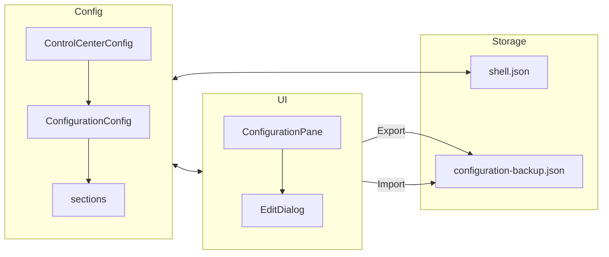

# 🔧 Configuration - Painel Configurável

**ID**: 29  
**Status**: ⏱️ Pronto para Implementação  
**Complexidade**: 🟡 Média  
**Tempo Estimado**: 6-8h (revisado)

---

## 📋 Resumo

Painel **"Configuration"** no Control Center totalmente configurável: seções e botões editáveis (nome, ícone, comando) para ferramentas do sistema (Audio, Display, Hardware, etc.), com export/import da configuração. Migra a lista hardcoded atual de `AppsPane.qml` para dados persistentes em `shell.json`.

**Renomeação**: A seção "Apps" passa a se chamar **"Configuration"** — reflete melhor o propósito (ferramentas de configuração do sistema, não gerenciamento de pacotes).

---

## 🎯 Objetivos

- Painel categorizado (Audio, Display, System, Hardware, Share) com dados em Config
- Botões editáveis: adicionar, editar, remover seções e botões
- Sem filtro `command -v` (mostrar todos os apps configurados; usuário remove manualmente)
- Export: backup em path fixo via `FileView.setText()`
- Import: carregar de arquivo (Process async) ou do clipboard
- Pendência: mapear comandos para "Keyboard config" e "Mouse config"

---

## ✅ Validações Técnicas (2026-02-05)

| Item | Status | Fonte |
|------|--------|-------|
| `Quickshell.clipboardText` READ/WRITE | ✅ | `qmlglobal.hpp` linha 124 |
| `Quickshell.execDetached(command)` | ✅ | AppsPane.qml linha 166 |
| `FileView.setText(text)` para salvar | ✅ | `fileview.hpp` linha 324; Config.qml usa |
| FileDialog `accepted(path)` signal | ✅ | `FileDialog.qml` linha 17 |
| StyledTextField componente | ✅ | `components/controls/StyledTextField.qml` |
| Process + StdioCollector pattern | ✅ | `SystemUsage.qml`, `Nmcli.qml` |
| WirelessPasswordDialog como modelo | ✅ | 513 linhas, bom exemplo de dialog modal |
| Toaster.toast() funciona | ✅ | Plugin C++, usado em Config.qml |
| ControlCenterConfig existe | ✅ | Apenas `sizes`; adicionar `configuration` |
| Config.save() trigger | ✅ | Chama saveTimer que serializa e salva |

### ❌ Removidos do Plano Original

| Item | Motivo |
|------|--------|
| CUtils.writeFile | **NÃO NECESSÁRIO** - FileView.setText() já existe |
| Passo 0 (plugin C++) | Removido - sem modificações em C++ necessárias |

---

## 🏗️ Arquitetura



### Estrutura em shell.json

```json
{
  "controlCenter": {
    "sizes": { "heightMult": 0.7, "ratio": 1.78 },
    "configuration": {
      "sections": [
        {
          "name": "Audio",
          "icon": "graphic_eq",
          "buttons": [
            {
              "name": "qpwgraph",
              "icon": "cable",
              "command": ["qpwgraph"],
              "description": "PipeWire Graph Manager"
            }
          ]
        }
      ]
    }
  }
}
```

### Formato JSON para Export/Import

```json
{
  "version": 1,
  "configuration": {
    "sections": [...]
  }
}
```

---

## 📂 Arquivos Afetados

| Arquivo | Ação |
|---------|------|
| `config/ConfigurationConfig.qml` | **CRIAR** - JsonObject com `sections: list<var>` |
| `config/ControlCenterConfig.qml` | Adicionar `configuration: ConfigurationConfig {}` |
| `config/Config.qml` | Adicionar em `serializeControlCenter()` |
| `modules/controlcenter/PaneRegistry.qml` | Mudar id/label de "apps" para "configuration" |
| `modules/controlcenter/configuration/ConfigurationPane.qml` | **CRIAR** (renomear de apps/) |
| `modules/controlcenter/configuration/EditDialog.qml` | **CRIAR** - Dialog genérico para edição |

---

## 📋 Passo a Passo de Implementação

### Passo 1: ConfigurationConfig.qml (~30min)

Criar `config/ConfigurationConfig.qml`:

```qml
import Quickshell.Io

JsonObject {
    property list<var> sections: [
        {
            name: qsTr("Audio"),
            icon: "graphic_eq",
            buttons: [
                { name: "qpwgraph", icon: "cable", command: ["qpwgraph"], description: qsTr("PipeWire Graph Manager") },
                { name: "EasyEffects", icon: "tune", command: ["easyeffects"], description: qsTr("Audio Effects & Equalizer") },
                { name: "PulseAudio Volume", icon: "volume_up", command: ["pavucontrol"], description: qsTr("Volume Control") }
            ]
        },
        {
            name: qsTr("Display"),
            icon: "monitor",
            buttons: [
                { name: "nwg-displays", icon: "desktop_windows", command: ["nwg-displays"], description: qsTr("Monitor Configuration") },
                { name: "Font Scaling", icon: "text_fields", command: ["font-scaling-manager"], description: qsTr("Font Size & DPI") }
            ]
        },
        {
            name: qsTr("System"),
            icon: "settings",
            buttons: [
                { name: "System Monitor", icon: "monitoring", command: ["gnome-system-monitor"], description: qsTr("Resource Monitor") },
                { name: "Logs", icon: "article", command: ["gnome-logs"], description: qsTr("System Logs") },
                { name: "Disk Usage", icon: "storage", command: ["baobab"], description: qsTr("Disk Usage Analyzer") }
            ]
        },
        {
            name: qsTr("Hardware"),
            icon: "memory",
            buttons: [
                { name: "Qt Camera", icon: "videocam", command: ["qcam"], description: qsTr("Camera Viewer (V4L2)") },
                { name: "Howdy Manager", icon: "face", command: ["howdy-manager"], description: qsTr("Facial Recognition") },
                { name: "ROG Control", icon: "sports_esports", command: ["rog-control-center"], description: qsTr("ASUS ROG Settings") }
            ]
        },
        {
            name: qsTr("Sharing"),
            icon: "share",
            buttons: [
                { name: "LocalSend", icon: "send", command: ["localsend_app"], description: qsTr("Local File Sharing") },
                { name: "Snapdrop", icon: "language", command: ["xdg-open", "https://snapdrop.net"], description: qsTr("Web-based Sharing") }
            ]
        }
    ]
}
```

### Passo 2: Integrar em ControlCenterConfig (~15min)

Em `config/ControlCenterConfig.qml`:
```qml
import Quickshell.Io

JsonObject {
    property Sizes sizes: Sizes {}
    property ConfigurationConfig configuration: ConfigurationConfig {}

    component Sizes: JsonObject {
        property real heightMult: 0.7
        property real ratio: 16 / 9
    }
}
```

### Passo 3: Atualizar Config.qml - serializeControlCenter (~15min)

```qml
function serializeControlCenter(): var {
    return {
        sizes: {
            heightMult: controlCenter.sizes.heightMult,
            ratio: controlCenter.sizes.ratio
        },
        configuration: {
            sections: controlCenter.configuration.sections
        }
    };
}
```

### Passo 4: Atualizar PaneRegistry.qml (~10min)

Mudar a entrada de "apps" para "configuration":
```qml
QtObject {
    readonly property string id: "configuration"
    readonly property string label: "configuration"
    readonly property string icon: "build"
    readonly property string component: "configuration/ConfigurationPane.qml"
}
```

### Passo 5: Mover e adaptar ConfigurationPane.qml (~1h)

1. Criar diretório `modules/controlcenter/configuration/`
2. Copiar `apps/AppsPane.qml` → `configuration/ConfigurationPane.qml`
3. Modificar:
   - Remover `appCategories` hardcoded
   - Usar `model: Config.controlCenter.configuration.sections`
   - Mudar `modelData.apps` → `modelData.buttons`
   - Adicionar botões de Edit no header

Estrutura principal:
```qml
// Header com ações
RowLayout {
    MaterialIcon { text: "build" }
    StyledText { text: qsTr("Configuration Tools") }
    Item { Layout.fillWidth: true }
    
    // Export button
    IconButton {
        icon: "save"
        onClicked: exportBackup()
    }
    
    // Import button
    IconButton {
        icon: "folder_open"
        onClicked: fileDialog.open()
    }
    
    // Add section button
    IconButton {
        icon: "add"
        onClicked: addSection()
    }
}

// Categories
Repeater {
    model: Config.controlCenter.configuration.sections
    
    ColumnLayout {
        // Section header with edit/delete
        RowLayout {
            MaterialIcon { text: modelData.icon }
            StyledText { text: modelData.name }
            Item { Layout.fillWidth: true }
            
            // Edit section
            IconButton {
                icon: "edit"
                onClicked: editSection(index)
            }
            
            // Add button to section
            IconButton {
                icon: "add"
                onClicked: addButton(index)
            }
            
            // Delete section
            IconButton {
                icon: "delete"
                onClicked: deleteSection(index)
            }
        }
        
        // Buttons in section
        Flow {
            Repeater {
                model: modelData.buttons
                
                StyledRect {
                    // Button content + edit/delete icons on hover
                }
            }
        }
    }
}
```

### Passo 6: EditDialog.qml (~1.5h)

Dialog genérico para editar seção ou botão:

```qml
// Baseado em WirelessPasswordDialog.qml
Item {
    id: root
    
    property string mode: "section" // "section" ou "button"
    property var itemData: null
    property int sectionIndex: -1
    property int buttonIndex: -1
    
    signal accepted(var editedItem)
    signal rejected
    
    function openForSection(index, data) {
        mode = "section"
        sectionIndex = index
        buttonIndex = -1
        itemData = data ? JSON.parse(JSON.stringify(data)) : { name: "", icon: "folder" }
        visible = true
    }
    
    function openForButton(sectIndex, btnIndex, data) {
        mode = "button"
        sectionIndex = sectIndex
        buttonIndex = btnIndex
        itemData = data ? JSON.parse(JSON.stringify(data)) : { name: "", icon: "apps", command: [], description: "" }
        visible = true
    }
    
    // Background overlay
    Rectangle {
        anchors.fill: parent
        color: Qt.rgba(0, 0, 0, 0.5)
        MouseArea { anchors.fill: parent; onClicked: root.rejected() }
    }
    
    // Dialog content
    StyledRect {
        anchors.centerIn: parent
        implicitWidth: 400
        
        ColumnLayout {
            // Title
            StyledText {
                text: root.mode === "section" 
                    ? (root.sectionIndex < 0 ? qsTr("Add Section") : qsTr("Edit Section"))
                    : (root.buttonIndex < 0 ? qsTr("Add Button") : qsTr("Edit Button"))
            }
            
            // Name field
            ColumnLayout {
                StyledText { text: qsTr("Name") }
                StyledTextField {
                    id: nameField
                    text: root.itemData?.name ?? ""
                    placeholderText: qsTr("Enter name")
                }
            }
            
            // Icon field
            ColumnLayout {
                StyledText { text: qsTr("Icon") }
                RowLayout {
                    MaterialIcon { text: iconField.text || "help" }
                    StyledTextField {
                        id: iconField
                        text: root.itemData?.icon ?? ""
                        placeholderText: qsTr("Material icon name")
                    }
                }
            }
            
            // Button-specific fields
            ColumnLayout {
                visible: root.mode === "button"
                
                StyledText { text: qsTr("Command") }
                StyledTextField {
                    id: commandField
                    text: root.itemData?.command?.join(" ") ?? ""
                    placeholderText: qsTr("e.g., pavucontrol")
                }
                
                StyledText { text: qsTr("Description") }
                StyledTextField {
                    id: descField
                    text: root.itemData?.description ?? ""
                    placeholderText: qsTr("Optional description")
                }
            }
            
            // Action buttons
            RowLayout {
                Item { Layout.fillWidth: true }
                
                StyledButton {
                    text: qsTr("Cancel")
                    onClicked: root.rejected()
                }
                
                StyledButton {
                    text: qsTr("Save")
                    enabled: nameField.text.trim() !== ""
                    onClicked: {
                        const result = {
                            name: nameField.text.trim(),
                            icon: iconField.text.trim() || "apps"
                        }
                        if (root.mode === "button") {
                            result.command = commandField.text.trim().split(/\s+/).filter(s => s)
                            result.description = descField.text.trim()
                        }
                        root.accepted(result)
                    }
                }
            }
        }
    }
}
```

### Passo 7: Funções de mutação em ConfigurationPane (~1h)

```qml
// Helper para mutação segura
function updateSections(mutator) {
    const copy = JSON.parse(JSON.stringify(Config.controlCenter.configuration.sections))
    mutator(copy)
    Config.controlCenter.configuration.sections = copy
    Config.save()
}

// Add section
function addSection() {
    editDialog.openForSection(-1, null)
}

// Edit section
function editSection(index) {
    editDialog.openForSection(index, Config.controlCenter.configuration.sections[index])
}

// Delete section (with confirmation)
function deleteSection(index) {
    // Simple confirmation via second click or inline
    updateSections(sections => sections.splice(index, 1))
    Toaster.toast(qsTr("Section removed"), "", "delete")
}

// Add button
function addButton(sectionIndex) {
    editDialog.openForButton(sectionIndex, -1, null)
}

// Edit button
function editButton(sectionIndex, buttonIndex) {
    editDialog.openForButton(sectionIndex, buttonIndex, 
        Config.controlCenter.configuration.sections[sectionIndex].buttons[buttonIndex])
}

// Delete button
function deleteButton(sectionIndex, buttonIndex) {
    updateSections(sections => sections[sectionIndex].buttons.splice(buttonIndex, 1))
}

// Handle dialog result
Connections {
    target: editDialog
    
    function onAccepted(item) {
        if (editDialog.mode === "section") {
            if (editDialog.sectionIndex < 0) {
                // New section
                updateSections(sections => sections.push({ ...item, buttons: [] }))
            } else {
                // Edit existing
                updateSections(sections => {
                    sections[editDialog.sectionIndex].name = item.name
                    sections[editDialog.sectionIndex].icon = item.icon
                })
            }
        } else {
            // Button
            if (editDialog.buttonIndex < 0) {
                // New button
                updateSections(sections => 
                    sections[editDialog.sectionIndex].buttons.push(item))
            } else {
                // Edit existing
                updateSections(sections => 
                    sections[editDialog.sectionIndex].buttons[editDialog.buttonIndex] = item)
            }
        }
        editDialog.visible = false
    }
    
    function onRejected() {
        editDialog.visible = false
    }
}
```

### Passo 8: Export/Import (~1h)

```qml
// FileView para backup
FileView {
    id: backupFileView
    path: "" // Set dynamically
    
    onSaved: Toaster.toast(qsTr("Backup saved"), backupPath, "save")
    onSaveFailed: err => Toaster.toast(qsTr("Failed to save backup"), 
        FileViewError.toString(err), "error", Toast.Error)
}

readonly property string backupPath: `${Paths.data}/configuration-backup.json`

// Export
function exportBackup() {
    const obj = {
        version: 1,
        configuration: {
            sections: Config.controlCenter.configuration.sections
        }
    }
    backupFileView.path = backupPath
    backupFileView.setText(JSON.stringify(obj, null, 2))
}

// FileDialog for Import
FileDialog {
    id: fileDialog
    title: qsTr("Select configuration backup")
    filters: ["*.json"]
    
    onAccepted: path => importFromFile(path)
}

// Import from file (using Process + StdioCollector)
Process {
    id: importProcess
    
    property string targetPath: ""
    
    stdout: StdioCollector {
        onStreamFinished: {
            try {
                const parsed = JSON.parse(text)
                applyImport(parsed)
            } catch (e) {
                Toaster.toast(qsTr("Invalid JSON"), e.message, "error", Toast.Error)
            }
        }
    }
}

function importFromFile(path) {
    importProcess.command = ["cat", path]
    importProcess.running = true
}

// Import from clipboard
function importFromClipboard() {
    try {
        const parsed = JSON.parse(Quickshell.clipboardText)
        applyImport(parsed)
    } catch (e) {
        Toaster.toast(qsTr("Invalid clipboard content"), e.message, "error", Toast.Error)
    }
}

// Apply imported config
function applyImport(parsed) {
    if (!parsed.configuration?.sections || !Array.isArray(parsed.configuration.sections)) {
        Toaster.toast(qsTr("Invalid format"), qsTr("Missing sections array"), "error", Toast.Error)
        return
    }
    
    Config.controlCenter.configuration.sections = parsed.configuration.sections
    Config.save()
    Toaster.toast(qsTr("Configuration imported"), 
        qsTr("%1 sections loaded").arg(parsed.configuration.sections.length), "download_done")
}
```

### Passo 9: Limpar pasta antiga e testar (~15min)

1. Remover `modules/controlcenter/apps/` (pasta antiga)
2. Testar:
   - Abrir Control Center → Configuration pane
   - Clicar em botões (deve executar comandos)
   - Adicionar/editar/remover seções e botões
   - Export e Import
   - Verificar persistência após restart

---

## 🧪 Casos de Teste

| Cenário | Ação | Resultado esperado |
|---------|------|--------------------|
| Visualização inicial | Abrir Configuration pane | 5 seções com botões |
| Executar app | Clicar em botão | App abre via execDetached |
| Adicionar seção | Click + preencher | Nova seção aparece, persiste |
| Editar seção | Click edit, mudar nome | Nome atualizado |
| Remover seção | Click delete | Seção removida |
| Adicionar botão | Click + na seção | Novo botão na seção |
| Editar botão | Click edit no botão | Dados atualizados |
| Remover botão | Click delete no botão | Botão removido |
| Export | Click export | Arquivo criado em `~/.local/share/caelestia/` |
| Import arquivo | Selecionar JSON válido | Seções atualizadas |
| Import clipboard | Colar JSON válido + import | Seções atualizadas |
| Import inválido | JSON malformado | Toast de erro, config inalterada |
| Persistência | Restart shell | Configuração mantida |

---

## ⚠️ Decisões de Simplificação

| Item | Decisão |
|------|---------|
| Confirmação de delete | Sem dialog - apenas remove (pode desfazer via import backup) |
| Filtro command -v | Não implementado - mostra todos os botões |
| Reordenação | Não implementado na v1 - editar via JSON se necessário |
| Validação de ícone | Apenas preview - aceita qualquer string |

---

## 🔗 Referências

- Pattern de dialog: `modules/controlcenter/network/WirelessPasswordDialog.qml`
- Pattern de Process: `services/SystemUsage.qml` (StdioCollector)
- Pattern de save: `config/Config.qml` (FileView.setText)
- FileView API: `quickshell-patched/src/io/fileview.hpp`
- Material Icons: https://fonts.google.com/icons
