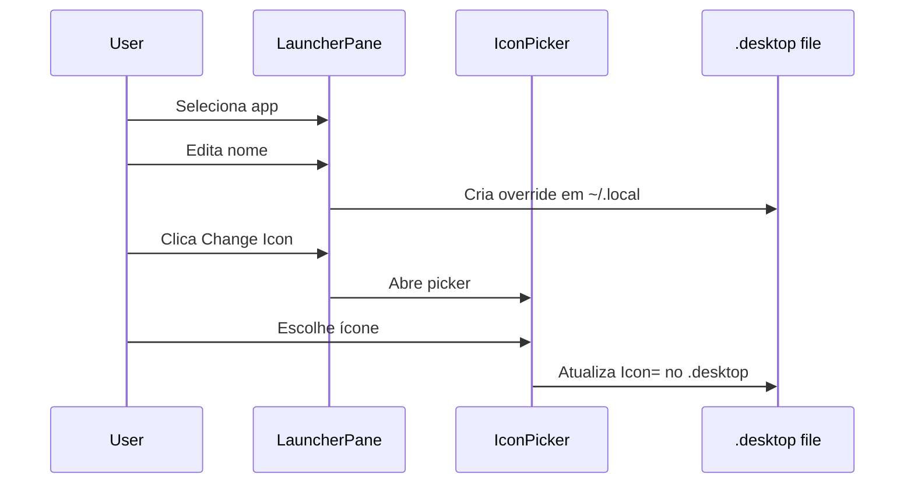

# 🎨 Launcher Customization - Editar Ícones/Nomes

**ID**: 30  
**Status**: ⏱️ Planejado  
**Complexidade**: 🟡 Média  
**Tempo Estimado**: 6-8h

---

## 📋 Resumo

Permitir edição de ícones e nomes de aplicações no launcher, salvando overrides em `~/.local/share/applications/`.

---

## 🎯 Objetivos

- Adicionar campos de edição no LauncherPane
- Criar .desktop override em `~/.local/share/applications/`
- Picker de ícones
- Persistência automática

### Arquitetura

```mermaid
flowchart TB
    subgraph System [System]
        UsrApps[/usr/share/applications]
    end
    
    subgraph User [User Overrides]
        LocalApps[~/.local/share/applications]
    end
    
    subgraph UI [UI]
        LauncherPane[LauncherPane]
        IconPicker[IconPickerDialog]
        LauncherPane --> IconPicker
    end
    
    UsrApps -->|read| LauncherPane
    LauncherPane -->|write override| LocalApps
    IconPicker -->|save icon| LocalApps
```

### Fluxo de Edição



---

## 🔍 Desktop Entries

### Localização

\`\`\`bash
# System-wide (read-only)
/usr/share/applications/*.desktop

# User overrides (read-write)
~/.local/share/applications/*.desktop
\`\`\`

### Formato

\`\`\`ini
[Desktop Entry]
Name=Custom Name
Icon=/path/to/icon.png
Exec=command %U
Type=Application
Categories=Utility;
\`\`\`

---

## 📂 Estrutura

### Modificar: `modules/controlcenter/launcher/LauncherPane.qml`

Adicionar campos de edição no painel de detalhes do app:

\`\`\`qml
// Seção de detalhes do app (quando selecionado)
ColumnLayout {
    // Nome customizado
    RowLayout {
        StyledText { text: qsTr("Custom Name:") }
        
        StyledTextField {
            id: customNameField
            placeholderText: displayedApp.name  // Nome original
            text: getCustomName(displayedApp.id)  // Nome override
            
            onEditingFinished: {
                saveCustomName(displayedApp.id, text)
            }
        }
    }
    
    // Ícone customizado
    RowLayout {
        StyledText { text: qsTr("Custom Icon:") }
        
        Image {
            source: getCustomIcon(displayedApp.id) || displayedApp.icon
            width: 48
            height: 48
        }
        
        StyledButton {
            text: qsTr("Change Icon")
            onClicked: iconPicker.open()
        }
    }
    
    // Reset
    StyledButton {
        text: qsTr("Reset to Default")
        onClicked: {
            removeCustomization(displayedApp.id)
        }
    }
}

// Icon Picker Dialog
IconPickerDialog {
    id: iconPicker
    
    onIconSelected: icon => {
        saveCustomIcon(displayedApp.id, icon)
    }
}
\`\`\`

---

### Novo: `modules/controlcenter/launcher/IconPickerDialog.qml`

\`\`\`qml
Popup {
    id: root
    
    signal iconSelected(string iconPath)
    
    width: 600
    height: 700
    
    ColumnLayout {
        // Tabs
        TabBar {
            id: tabBar
            TabButton { text: qsTr("System Icons") }
            TabButton { text: qsTr("Custom File") }
        }
        
        StackLayout {
            currentIndex: tabBar.currentIndex
            
            // Tab 1: System icons
            GridView {
                model: ["applications-*", "preferences-*", "system-*"]
                delegate: IconButton {
                    icon: modelData
                    onClicked: root.iconSelected(modelData)
                }
            }
            
            // Tab 2: File picker
            FilePickerInput {
                filter: "Images (*.png *.svg *.jpg)"
                onValueChanged: value => {
                    root.iconSelected(value)
                }
            }
        }
    }
}
\`\`\`

---

## 🔧 Implementação

### Sistema de Overrides

> **IMPORTANTE**: QML não tem `new File()`. Usar `FileView` do Quickshell.

\`\`\`qml
// Em services/AppCustomization.qml (novo singleton)

pragma Singleton
import Quickshell
import Quickshell.Io
import QtQuick
import qs.config

QtObject {
    id: root
    
    readonly property string overridesPath: Paths.data + "/app-overrides.json"
    property var overrides: ({})
    
    // FileView para ler/escrever JSON
    FileView {
        id: overridesFile
        path: Qt.resolvedUrl("file://" + root.overridesPath)
        
        onTextChanged: {
            if (text) {
                try {
                    root.overrides = JSON.parse(text)
                } catch (e) {
                    console.error("Failed to parse overrides:", e)
                    root.overrides = {}
                }
            }
        }
    }
    
    function getCustomName(appId) {
        return overrides[appId]?.name ?? ""
    }
    
    function getCustomIcon(appId) {
        return overrides[appId]?.icon ?? ""
    }
    
    function saveCustomName(appId, name) {
        if (!overrides[appId]) overrides[appId] = {}
        overrides[appId].name = name
        saveOverrides()
        createDesktopOverride(appId)
    }
    
    function saveCustomIcon(appId, icon) {
        if (!overrides[appId]) overrides[appId] = {}
        overrides[appId].icon = icon
        saveOverrides()
        createDesktopOverride(appId)
    }
    
    function saveOverrides() {
        overridesFile.setText(JSON.stringify(overrides, null, 2))
    }
    
    function removeCustomization(appId) {
        delete overrides[appId]
        saveOverrides()
        // Remover .desktop override
        removeProcess.command = ["rm", "-f", 
            Paths.home + "/.local/share/applications/" + appId + ".desktop"]
        removeProcess.running = true
    }
    
    Process {
        id: removeProcess
    }
    
    // Process para criar override via script
    property var createProcess: null
    
    function createDesktopOverride(appId) {
        if (createProcess) createProcess.destroy()
        
        createProcess = Qt.createQmlObject(\`
            import Quickshell
            Process {
                command: ["bash", Paths.scriptPath("create-desktop-override.sh"),
                          "\${appId}",
                          "\${overrides[appId]?.name ?? ''}",
                          "\${overrides[appId]?.icon ?? ''}"]
            }
        \`, root, "createProcess")
        
        createProcess.running = true
    }
    
    Component.onCompleted: overridesFile.reload()
}
\`\`\`

### Script: `scripts/create-desktop-override.sh`

\`\`\`bash
#!/bin/bash
APP_ID=\$1
CUSTOM_NAME=\$2
CUSTOM_ICON=\$3

# Encontrar .desktop original
ORIG_DESKTOP=\$(find /usr/share/applications -name "\${APP_ID}.desktop" | head -1)

if [ -z "\$ORIG_DESKTOP" ]; then
    echo "App not found"
    exit 1
fi

# Copiar para user dir
USER_DIR=~/.local/share/applications
mkdir -p "\$USER_DIR"

cp "\$ORIG_DESKTOP" "\$USER_DIR/\${APP_ID}.desktop"

# Modificar Name e Icon
sed -i "s/^Name=.*/Name=\$CUSTOM_NAME/" "\$USER_DIR/\${APP_ID}.desktop"
sed -i "s|^Icon=.*|Icon=\$CUSTOM_ICON|" "\$USER_DIR/\${APP_ID}.desktop"

echo "Override created: \$USER_DIR/\${APP_ID}.desktop"
\`\`\`

---

## 🧪 Testes

- [ ] Campos de edição aparecem
- [ ] Mudar nome → salva override
- [ ] Mudar ícone → salva override
- [ ] .desktop criado em ~/.local/share/applications/
- [ ] Launcher mostra nome/ícone customizado
- [ ] Reset restaura original
- [ ] Persistência funciona após reiniciar

---

## ✅ Validações Confirmadas (2026-02-05)

| Item | Decisão |
|------|---------|
| File I/O | Usar `FileView` + `setText()` (não existe `new File()` em QML) |
| Process | Usar `Process` + `StdioCollector` para scripts |
| Referência | `config/Config.qml:442` — padrão FileView |
| Overrides path | `~/.local/share/caelestia/app-overrides.json` |

---

**Desafio**: Lidar com IDs de apps (pode variar entre distros)
