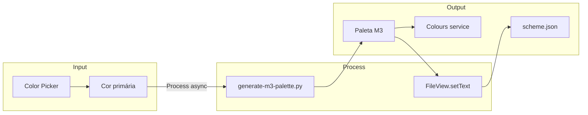

# 🎨 Theme Customization - Preto/Amarelo Customizável

**ID**: 31  
**Status**: ⏱️ Planejado  
**Complexidade**: 🔴 Alta  
**Tempo Estimado**: 10-15h

---

## 📋 Resumo

Sistema completo de customização de cores do tema, permitindo ao usuário criar paletas Material Design 3 personalizadas via UI.

---

## 🎯 Objetivos

- Color picker para cor primária
- Gerar paleta M3 completa (~50 cores)
- Preview em tempo real
- Salvar temas customizados
- Temas pré-definidos

---

## 🎨 Material Design 3 Colors

### Paleta Completa

M3 usa ~50 cores derivadas:

\`\`\`
- primary, onPrimary
- primaryContainer, onPrimaryContainer
- secondary, onSecondary
- secondaryContainer, onSecondaryContainer
- tertiary, onTertiary
- tertiaryContainer, onTertiaryContainer
- error, onError
- errorContainer, onErrorContainer
- background, onBackground
- surface, onSurface
- surfaceVariant, onSurfaceVariant
- outline, outlineVariant
- ... etc (~50 total)
\`\`\`

### Arquitetura de Geração de Paleta

### Geração Automática

**Ferramentas**:
- Material Theme Builder: https://m3.material.io/theme-builder
- material-color-utilities (lib): https://github.com/material-foundation/material-color-utilities

---

## 📂 Estrutura

### 1. `services/ThemeGenerator.qml` (Novo)

> **IMPORTANTE**: Usar `FileView` do Quickshell para I/O (não CUtils).

\`\`\`qml
pragma Singleton
import Quickshell
import Quickshell.Io
import QtQuick
import qs.services
import qs.config

QtObject {
    id: root
    
    // Input: cor primária
    property color primaryColor: "#ffc107"
    property var generatedPalette: null
    property bool generating: false
    
    // FileView para salvar scheme.json
    FileView {
        id: schemeFile
        path: Qt.resolvedUrl("file://" + Paths.config + "/scheme.json")
    }
    
    // Process para gerar paleta via Python
    Process {
        id: generateProcess
        command: ["python3", Paths.scriptPath("generate-m3-palette.py"), root.primaryColor.toString()]
        
        stdout: StdioCollector {
            onStreamFinished: {
                try {
                    root.generatedPalette = JSON.parse(text)
                    root.generating = false
                } catch (e) {
                    console.error("Failed to parse palette:", e)
                    root.generating = false
                }
            }
        }
        
        onExited: (exitCode) => {
            if (exitCode !== 0) {
                console.error("generate-m3-palette.py failed with code:", exitCode)
                root.generating = false
            }
        }
    }
    
    function generatePalette(color) {
        primaryColor = color
        generating = true
        generateProcess.command = ["python3", Paths.scriptPath("generate-m3-palette.py"), color.toString()]
        generateProcess.running = true
    }
    
    function applyPalette() {
        if (!generatedPalette) return
        
        // Salvar em scheme.json
        schemeFile.setText(JSON.stringify(generatedPalette, null, 2))
        
        // Aplicar imediatamente via Colours service
        Colours.load(JSON.stringify(generatedPalette), false)
    }
}
\`\`\`

### 2. Script: `scripts/generate-m3-palette.py`

\`\`\`python
#!/usr/bin/env python3
import sys
import json
from material_color_utilities_python import themeFromSourceColor, hexFromArgb

# Input: hex color
primary_hex = sys.argv[1]
primary_argb = int(primary_hex.replace("#", ""), 16)

# Gerar tema M3
theme = themeFromSourceColor(primary_argb, [])

# Converter para JSON
palette = {
    "primary": hexFromArgb(theme['schemes']['dark']['primary']),
    "onPrimary": hexFromArgb(theme['schemes']['dark']['onPrimary']),
    # ... todas as ~50 cores
}

print(json.dumps(palette))
\`\`\`

### 3. UI: `modules/controlcenter/appearance/sections/ThemeSection.qml`

\`\`\`qml
ColumnLayout {
    SectionLabel { text: qsTr("Theme Customization") }
    
    // Color picker
    RowLayout {
        StyledText { text: qsTr("Primary Color:") }
        
        ColorPicker {
            id: primaryPicker
            color: Colours.palette.m3primary
            
            onColorChanged: {
                // Preview
                ThemeGenerator.primaryColor = color
            }
        }
        
        // Preview circle
        Rectangle {
            width: 40
            height: 40
            radius: 20
            color: primaryPicker.color
        }
    }
    
    // Apply button
    StyledButton {
        text: qsTr("Apply Theme")
        icon: "palette"
        
        onClicked: {
            var palette = ThemeGenerator.generatePalette(primaryPicker.color)
            ThemeGenerator.applyPalette(palette)
        }
    }
    
    // Preset themes
    SectionLabel { text: qsTr("Presets") }
    
    GridLayout {
        columns: 4
        
        Repeater {
            model: [
                { name: "Ocean Blue", color: "#1976d2" },
                { name: "Sunset Orange", color: "#ff6f00" },
                { name: "Forest Green", color: "#2e7d32" },
                { name: "Royal Purple", color: "#6a1b9a" },
                { name: "Cherry Red", color: "#c62828" },
                { name: "Golden Yellow", color: "#ffc107" }
            ]
            
            delegate: ThemePresetButton {
                name: modelData.name
                color: modelData.color
                
                onClicked: {
                    primaryPicker.color = color
                }
            }
        }
    }
}
\`\`\`

---

## 🔧 Implementação

### Pré-requisito: Python lib

\`\`\`bash
pip install material-color-utilities-python
\`\`\`

### Fase 1: Gerador de Paleta (4-5h)

1. Instalar lib: `pip install material-color-utilities-python`
2. Criar `scripts/generate-m3-palette.py`
3. Testar geração via CLI: `python3 scripts/generate-m3-palette.py "#ffc107"`
4. Criar `services/ThemeGenerator.qml` — usar **Process** + **StdioCollector** + **FileView**

### Fase 2: UI (3-4h)

1. `ThemeSection.qml` com color picker
2. Preview em tempo real
3. Botão Apply
4. Temas pré-definidos

### Fase 3: Persistência (2-3h)

1. Salvar em `scheme.json` via `FileView.setText()`
2. Reload automático
3. Aplicar ao sistema via `Colours.load()`

### Fase 4: Polish (1-2h)

- Animações
- Feedback visual
- Error handling

---

## 🧪 Testes

- [ ] Color picker funciona
- [ ] Gerar paleta M3 funciona
- [ ] Aplicar tema funciona
- [ ] Preview em tempo real
- [ ] Temas pré-definidos funcionam
- [ ] Persistência funciona
- [ ] Cores aplicam em todos componentes

---

## 🐛 Desafios

### 1. Dependência Python

**Solução**: Embedd lib ou usar JS implementation

### 2. Performance

Gerar paleta pode demorar ~1s

**Solução**: Loading indicator, cache

### 3. Aplicar em Tempo Real

Mudar `Colours.palette.*` pode não atualizar tudo

**Solução**: Reiniciar Quickshell ou force reload

---

## ✅ Validações Confirmadas (2026-02-05)

| Item | Decisão |
|------|---------|
| File I/O | Usar `FileView` + `setText()` (padrão Quickshell) |
| Script Python | `Process` + `StdioCollector` para rodar generate-m3-palette.py |
| Referência | `config/Config.qml:442` — padrão FileView |
| Colours reload | `Colours.load(json, false)` para aplicar imediatamente |

**APIs confirmadas**:
- `FileView.setText(content)` — salvar scheme.json
- `FileView.text()` — ler scheme.json
- `Process` + `StdioCollector` — rodar script Python
- `Colours.load(json, false)` — aplicar paleta (ver `services/Colours.qml`)

---

**Complexo mas impactante!** Feature premium para usuários avançados.
