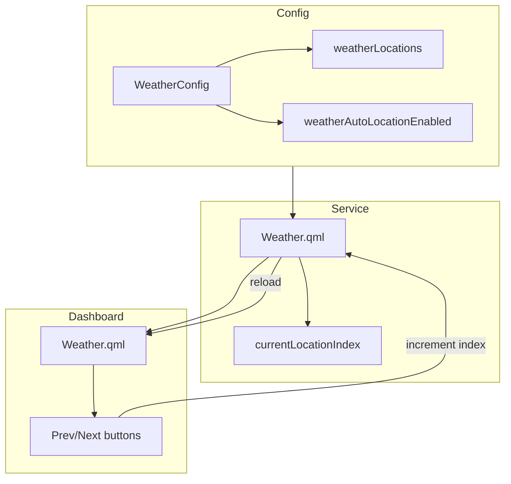
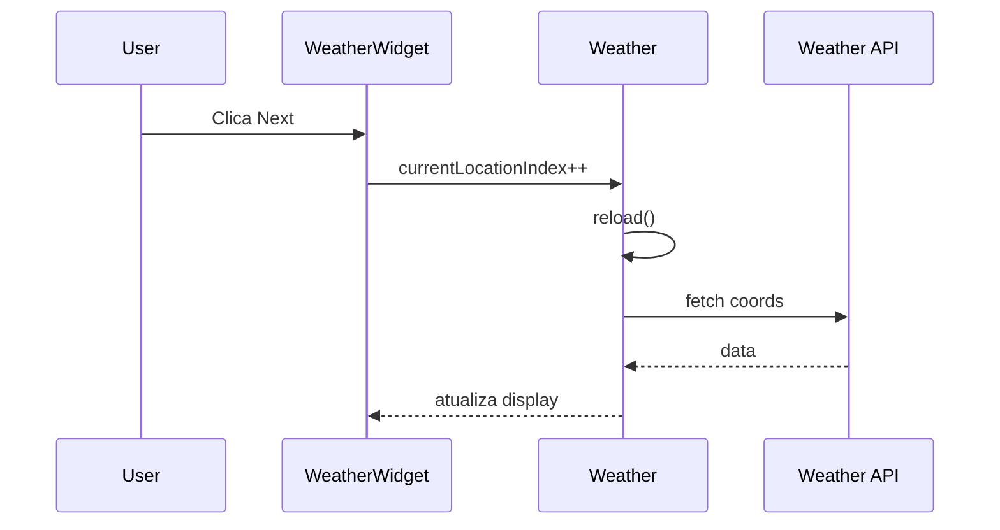

# 🌤️ Weather - Múltiplas Localizações (Dashboard)

**ID**: 33 (V3-09)  
**Status**: ⏱️ Planejado  
**Complexidade**: 🟡 Média  
**Tempo Estimado**: 6-8h

---

## 📋 Resumo

Config com lista de locais; último = automático (toggle); no Dashboard Weather, botões próximo/voltar; ordem = config.

---

## 🎯 Objetivos

- Config com lista de localizações (name, coords)
- Toggle para localização automática (ipinfo.io) como último item
- Dashboard Weather com botões prev/next para navegar entre locais
- Ordem dos locais definida pela config

---

## 🏗️ Arquitetura



### Fluxo de Navegação



---

## 📂 Estrutura de Arquivos

### 1. Config: Estender `config/ServiceConfig.qml` ou criar `config/WeatherConfig.qml`

```qml
// Em ServiceConfig.qml ou novo WeatherConfig.qml
property list<var> weatherLocations: []  // cada item: { name: string, coords: "lat,lon" }
property bool weatherAutoLocationEnabled: true
```

### 2. `services/Weather.qml` - Refatorar

```qml
property int currentLocationIndex: 0

readonly property var locations: {
    var list = Config.services.weatherLocations || []
    if (Config.services.weatherAutoLocationEnabled)
        list.push({ name: qsTr("Auto"), coords: "auto" })
    return list
}

readonly property var currentLocation: locations[currentLocationIndex] ?? { name: "", coords: "" }

function reload(): void {
    const loc = currentLocation
    if (!loc || !loc.coords) return
    if (loc.coords === "auto") {
        // ipinfo.io como hoje
    } else {
        loc = loc.coords
        fetchCityFromCoords(loc.coords)
    }
    fetchWeatherData()
}
```

### 3. `modules/dashboard/Weather.qml` - Botões prev/next

```qml
// Adicionar Row com botões
RowLayout {
    IconButton {
        icon: "arrow_back"
        onClicked: {
            var total = Weather.locations.length
            Weather.currentLocationIndex = (Weather.currentLocationIndex - 1 + total) % total
            Weather.reload()
        }
    }
    
    StyledText {
        text: Weather.currentLocation?.name ?? Weather.city ?? qsTr("Loading...")
    }
    
    IconButton {
        icon: "arrow_forward"
        onClicked: {
            var total = Weather.locations.length
            Weather.currentLocationIndex = (Weather.currentLocationIndex + 1) % total
            Weather.reload()
        }
    }
}
```

### 4. Settings: Novo painel ou seção em Appearance/General

- Lista de locais com add/remove/edit
- Toggle "Usar localização automática (último)"
- Ordem arrastar ou numerar

---

## 🔧 Implementação

1. **Config** (1h): Estender ServiceConfig com weatherLocations, weatherAutoLocationEnabled. Serialize em Config.qml.
2. **Weather service** (2-3h): Refatorar para currentLocationIndex, locations, reload() baseado em currentLocation.
3. **Dashboard Weather** (1-2h): Botões prev/next, exibir nome do local atual.
4. **Settings pane** (2-3h): WeatherSettingsPane ou seção em GeneralConfig para configurar locations.

**Total**: 6-8h

---

## 🧪 Testes

- [ ] Lista de locais carrega da config
- [ ] Toggle auto location funciona
- [ ] Botão prev navega para local anterior
- [ ] Botão next navega para próximo local
- [ ] Nome do local exibido corretamente
- [ ] Weather data atualiza ao trocar local
- [ ] Persistência em shell.json

---

## 📝 Nota: Lock Screen

No lock screen, o Weather exibe apenas a **primeira localização** da lista (ou auto se for a única). Não há botões prev/next no lock — apenas no Dashboard.

---

## 📚 Referências

- **Fonte**: [21-caelestia-custom-v3.md](../../../caelestia-arch-setup/development/docs/21-caelestia-custom-v3.md) — V3-09
- **Estado atual**: `services/Weather.qml` usa `Config.services.weatherLocation` (string única)
- **ServiceConfig**: `config/ServiceConfig.qml` — `weatherLocation: ""`
