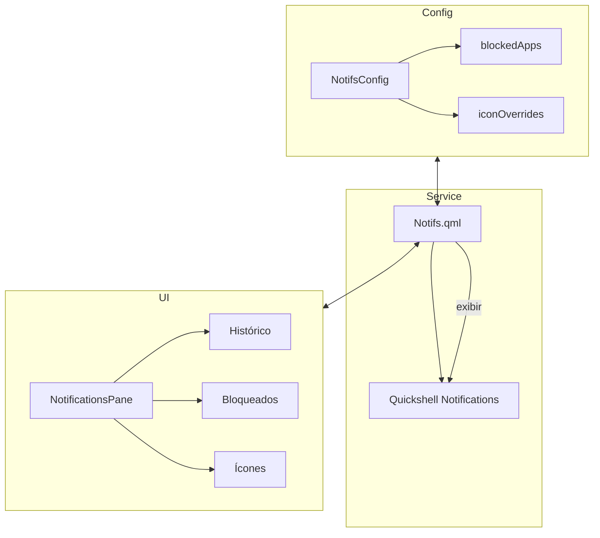
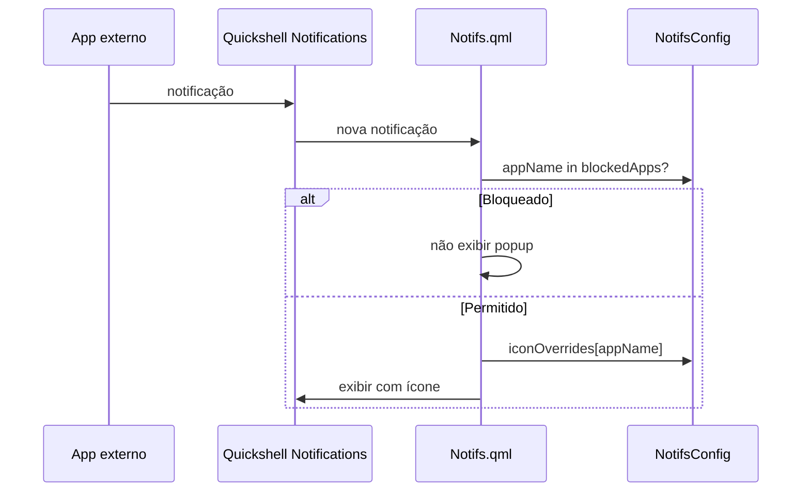

# 🔔 Notification Manager

**ID**: 34 (V3-10)  
**Status**: ⏱️ Planejado  
**Complexidade**: 🔴 Alta  
**Tempo Estimado**: 12-16h

---

## 📋 Resumo

Histórico de notificações + bloquear/desbloquear por app + definir ícone para notificações sem ícone.

---

## 🎯 Objetivos

- Histórico de notificações (persistir em memória ou SQLite)
- Bloquear/desbloquear notificações por app
- Definir ícone override para apps sem ícone
- Painel Notifications no Control Center

---

## 🏗️ Arquitetura



### Fluxo de Exibição de Notificação



---

## 📂 Estrutura de Arquivos

### 1. `config/NotifsConfig.qml` - Estender

```qml
property list<string> blockedApps: []
property var iconOverrides: {}  // appName -> icon path ou nome
```

### 2. `services/Notifs.qml` - Modificar

- Ao exibir notificação: verificar se `appName` está em `blockedApps`; se sim, não exibir popup (ou exibir em área "bloqueadas")
- Ao exibir ícone: usar `iconOverrides[appName] ?? notif.appIcon ?? defaultIcon`
- Histórico: Notifs já persiste `notClosed` via `storage.setText`. Verificar se há lista de histórico completo ou apenas notificações abertas. Se não houver histórico, adicionar lista que retenha últimas N notificações (appName, summary, body, icon, timestamp)

### 3. `modules/controlcenter/notifications/NotificationsPane.qml` (novo)

```qml
// Abas ou seções:
// - Histórico: lista de notificações recentes
// - Bloqueados: lista de apps com toggle block/unblock
// - Ícones: lista de apps com campo icon override
```

### 4. `modules/controlcenter/PaneRegistry.qml`

Adicionar pane `{ id: "notifications", label: "notifications", icon: "notifications", component: "notifications/NotificationsPane.qml" }`

---

## 🔧 Implementação

1. **Config** (1h): Estender NotifsConfig com blockedApps, iconOverrides. Serialize em Config.qml.
2. **Histórico** (3-4h): Verificar se Toaster/Notifs já armazena histórico. Se não, adicionar lista em Notifs que retenha últimas N notificações.
3. **Bloquear** (2-3h): Ao exibir, verificar blockedApps. Não exibir popup se bloqueado.
4. **Ícone override** (1-2h): Ao exibir, usar iconOverrides[appName] ?? notif.appIcon.
5. **Pane** (4-5h): NotificationsPane com abas Histórico, Bloqueados, Ícones.

**Total**: 12-16h

---

## ⚠️ Complexidade

**Alta** — depende da estrutura interna do Quickshell Notifications. O Notifs.qml usa `NotificationServer` do Quickshell; o histórico pode já existir via `storage.setText`.

---

## ✅ Validações Confirmadas (2026-02-01)

| Item | Decisão |
|------|---------|
| Investigação prévia | **Criar tarefa de investigação** antes de implementar |

**Passo 0 (obrigatório)**: Investigar estrutura do Quickshell Notifications (NotificationServer, PersistentProperties, storage.setText) antes de implementar. Documentar achados em doc de investigação.

---

## 🧪 Testes

- [ ] Histórico exibe notificações recentes
- [ ] Bloquear app → notificações não aparecem
- [ ] Desbloquear app → notificações voltam
- [ ] Ícone override aplica corretamente
- [ ] Persistência em shell.json

---

## 📚 Referências

- **Fonte**: [21-caelestia-custom-v3.md](../../../caelestia-arch-setup/development/docs/21-caelestia-custom-v3.md) — V3-10
- **Estado atual**: `services/Notifs.qml` — NotificationServer, PersistentProperties
- **NotifsConfig**: `config/NotifsConfig.qml` — sizes, expire, etc.
