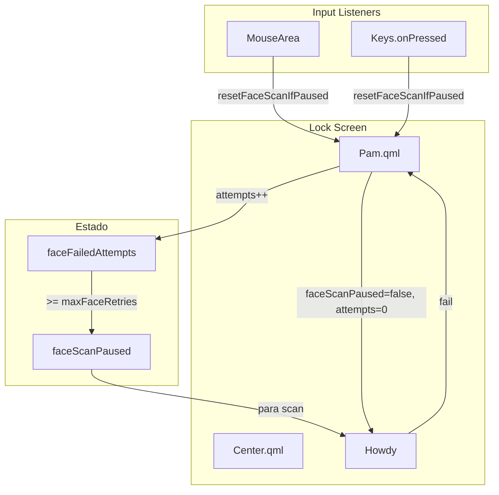
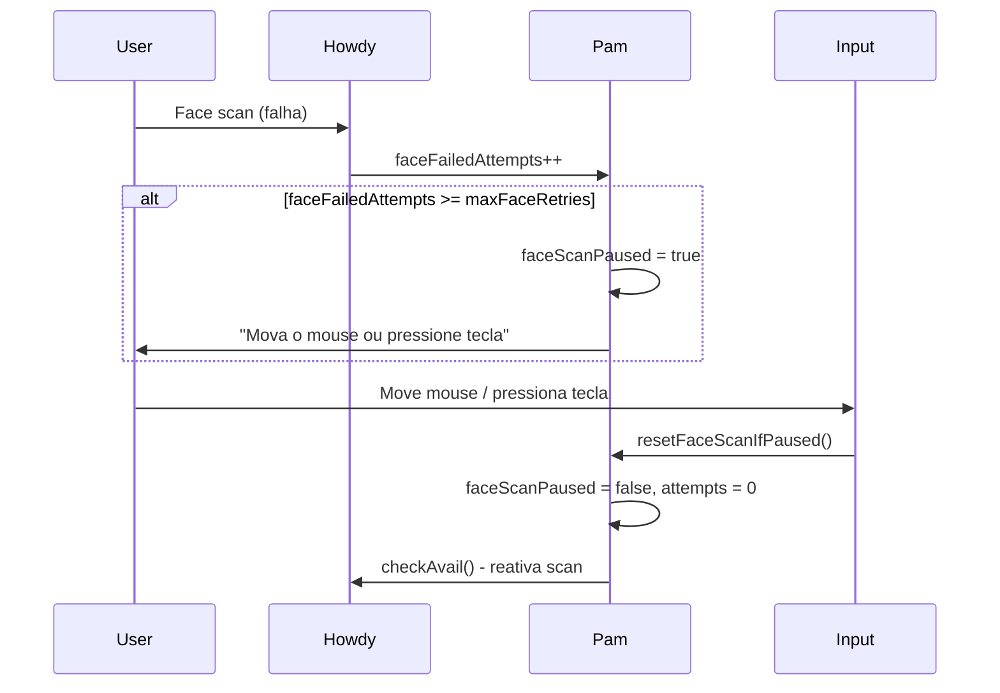

# 👤 Face Reading Retry (Howdy)

**ID**: 35 (V3-12)  
**Status**: ⏱️ Planejado  
**Complexidade**: 🟡 Média  
**Tempo Estimado**: 4-6h

---

## 📋 Resumo

N tentativas de face → pausar scan. Reativar scan ao detectar input (mouse, touchpad, tecla).

---

## 🎯 Objetivos

- Após max tentativas de face, pausar scan (não desabilitar permanentemente)
- Mostrar mensagem "Mova o mouse ou pressione uma tecla para tentar novamente"
- Input (mouse, tecla) reativa o scan e reseta contador

---

## 🏗️ Arquitetura



### Fluxo de Pausa e Reativação



---

## 📂 Estrutura de Arquivos

### 1. `modules/lock/Pam.qml` ou `modules/lock/Center.qml`

```qml
property bool faceScanPaused: false

// Quando howdy onCompleted fail:
// faceFailedAttempts++
// Se faceFailedAttempts >= maxFaceRetries: faceScanPaused = true, parar howdy
```

### 2. Lock/Center - Input listeners

```qml
// MouseArea que cobre tela
MouseArea {
    anchors.fill: parent
    onClicked: resetFaceScanIfPaused()
    onPositionChanged: resetFaceScanIfPaused()
}

Keys.onPressed: (event) => {
    if (faceScanPaused) resetFaceScanIfPaused()
}

function resetFaceScanIfPaused() {
    if (!faceScanPaused) return
    faceScanPaused = false
    faceFailedAttempts = 0
    howdy.checkAvail()
}
```

### 3. Mensagem quando pausado

```qml
StyledText {
    visible: faceScanPaused
    text: qsTr("Mova o mouse ou pressione uma tecla para tentar novamente")
}
```

### 4. `config/LockConfig.qml`

- `maxFaceRetries` já existe. Garantir valor default razoável (ex: 5).

---

## 🔧 Implementação

1. **Novo estado** (1h): Adicionar `faceScanPaused` em Pam.qml ou Center.qml.
2. **Fluxo pausa** (1h): No handler de falha do Howdy, se `faceFailedAttempts >= maxFaceRetries`, setar `faceScanPaused = true`.
3. **Input listeners** (2h): MouseArea + Keys.onPressed no Lock/Center.
4. **Mensagem** (30 min): Exibir texto quando pausado.
5. **Testes** (1h).

**Total**: 4-6h

---

## 🧪 Testes

- [ ] Após N falhas, scan pausa
- [ ] Mensagem "Mova o mouse..." aparece
- [ ] Mover mouse reativa scan
- [ ] Pressionar tecla reativa scan
- [ ] Contador reseta ao reativar
- [ ] Howdy.checkAvail() é chamado

---

## 📚 Referências

- **Fonte**: [21-caelestia-custom-v3.md](../../../caelestia-arch-setup/development/docs/21-caelestia-custom-v3.md) — V3-12
- **Estado atual**: Pam.qml tem `faceFailedAttempts`, `maxFaceRetries`. Após max, `faceEnabled = false` (desabilita permanentemente).
- **LockConfig**: `config/LockConfig.qml` — `maxFaceRetries`
- **Arquitetura**: `docs/10-arquitetura.md` — Face: 5 falhas → disabled

---

## ✅ Validações Confirmadas (2026-02-05)

| Item | Decisão |
|------|---------|
| Estado atual | `Pam.qml:22` — `faceEnabled`, `faceFailedAttempts` já existem |
| Comportamento atual | Linha 217-218: após maxFaceRetries, `faceEnabled = false` (permanente) |
| Mudança necessária | Trocar `faceEnabled = false` por `faceScanPaused = true` |
| Referência | `modules/lock/Pam.qml` — linhas 216-218 |

### Código atual a modificar (linha 216-218):

```qml
root.faceFailedAttempts++;
if (root.faceFailedAttempts >= Config.lock.auth.maxFaceRetries) {
    root.faceEnabled = false;  // ← Mudar para faceScanPaused = true
}
```
