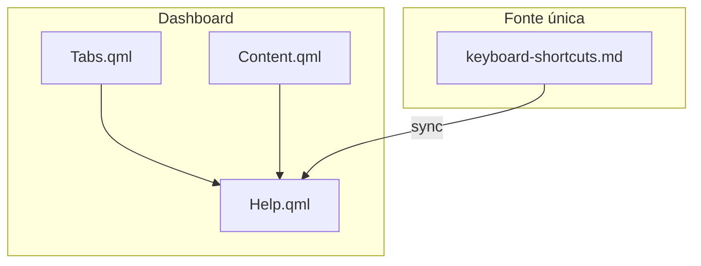

# ❓ Help - Aba no Dashboard

**ID**: 36 (V3-05 — variante dashboard)  
**Status**: ⏱️ Planejado  
**Complexidade**: 🟡 Média  
**Tempo Estimado**: 3-4h

---

## 📋 Resumo

Nova aba "Help" na visualização do dashboard (junto a Dashboard, Media, Performance, Weather), exibindo os atalhos de teclado. **Separado** do Help Modal com shortcut (Super+F1) descrito em [28-help-modal.md](28-help-modal.md).

---

## 🎯 Objetivos

- Nova aba "Help" nas abas do dashboard
- Conteúdo = **keyboard-shortcuts.md** (fonte única; categorias e itens)
- Layout 3 colunas
- Sem shortcut — acesso apenas pela aba

---

## 🏗️ Arquitetura



**Componentes**:
- `Tabs.qml`: adicionar Tab { iconName: "help"; text: "Help" }
- `Content.qml`: adicionar Pane { index: 4; sourceComponent: Help {} }
- `modules/dashboard/Help.qml`: conteúdo sincronizado com keyboard-shortcuts.md (compartilhado com Help Modal 28)

---

## 📂 Estrutura de Arquivos

### 1. `modules/dashboard/Tabs.qml`

Adicionar Tab após Weather:

```qml
Tab {
    iconName: "help"
    text: qsTr("Help")
}
```

### 2. `modules/dashboard/Content.qml`

Adicionar Pane para Help (index 4):

```qml
Pane {
    index: 4
    sourceComponent: Help {}
}
```

### 3. `modules/dashboard/Help.qml` (novo)

- GridLayout com `columns: 3`
- Categorias e shortcuts sincronizados com [keyboard-shortcuts.md](../../../caelestia-arch-setup/docs/advanced/keyboard-shortcuts.md)
- Mesma estrutura visual do HelpModal (28) mas como componente de aba, sem popup

---

## 🔧 Implementação

1. **Help.qml** (2h): Criar componente com layout 3 colunas, categorias e itens.
2. **Tabs.qml** (15 min): Adicionar Tab Help.
3. **Content.qml** (15 min): Adicionar Pane com Help.
4. **Sincronizar conteúdo** (1h): Mapear keyboard-shortcuts.md para estrutura QML.

**Total**: 3-4h

---

## 🧪 Testes

- [ ] Aba Help aparece no dashboard
- [ ] Conteúdo exibe categorias corretas
- [ ] Layout 3 colunas
- [ ] Scroll funciona se conteúdo longo
- [ ] Navegação entre abas funciona

---

## ✅ Validações Confirmadas (2026-02-01)

| Item | Decisão |
|------|---------|
| Fonte de shortcuts | **keyboard-shortcuts.md** (arquivo em docs) como fonte única — compartilhado com Help Modal (28) |

---

## 📚 Referências

- **Fonte**: [21-caelestia-custom-v3.md](../../../caelestia-arch-setup/development/docs/21-caelestia-custom-v3.md) — V3-05 (variante dashboard)
- **Separado de**: [28-help-modal.md](28-help-modal.md) — Help Modal com shortcut Super+F1
- **Conteúdo**: [keyboard-shortcuts.md](../../../caelestia-arch-setup/docs/advanced/keyboard-shortcuts.md) — **fonte única** (validado 2026-02-01)
- **Dashboard atual**: Tabs = Dashboard, Media, Performance, Weather (Content.qml, Tabs.qml)
