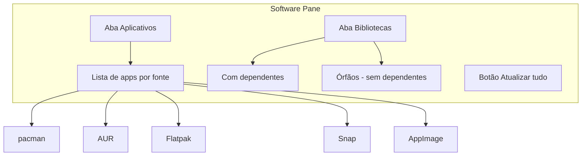
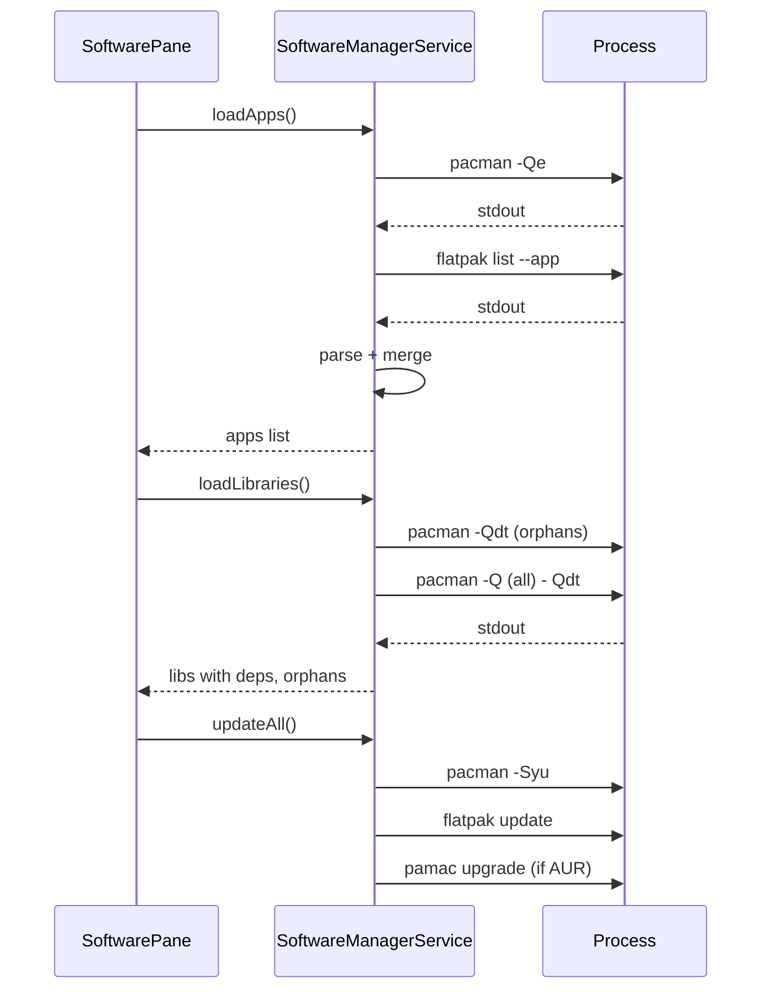

# 📦 Software Manager - Atualizar e Remover Aplicativos

**ID**: 37  
**Status**: ⏱️ Planejado  
**Complexidade**: 🔴 Alta  
**Tempo Estimado**: 15-23h

---

## 📋 Resumo

Interface no Control Center para facilitar **atualização** e **remoção** de aplicativos instalados no PC. Coleta software de **todas as fontes** (pacman, AUR, Flatpak, Snap, AppImage). Duas abas: **Aplicativos** e **Bibliotecas** (esta com subseções "Com dependentes" e "Órfãos" para identificar pacotes desnecessários).

---

## ✅ Decisões Confirmadas (2026-02)

| Item | Decisão |
|------|---------|
| Fontes | **Todas**: pacman, AUR, Flatpak, Snap, AppImage |
| AppImage | Scan automático em ~/Applications, ~/bin, ~/.local/bin |
| Localização | Novo pane "Apps" ou "Software" no Control Center |
| Órfãos (bibliotecas) | Investigar suporte por fonte (pacman tem; Flatpak tem; AUR depende do helper) |
| Atualização | Um botão "Atualizar tudo" (pacman + flatpak + pamac, etc.) |

---

## 🏗️ Arquitetura da UI



---

## 📑 Estrutura de Abas

### Aba 1: Aplicativos

- Lista de software instalado que são **aplicativos** (não bibliotecas)
- Agrupado ou filtrado por fonte: pacman, AUR, Flatpak, Snap, AppImage
- Ações: Remover, Info
- Busca/filtro por nome

### Aba 2: Bibliotecas

- Lista de pacotes que são **bibliotecas/dependências**
- **Subseção "Com dependentes"**: pacotes que outros softwares precisam (cuidado ao remover)
- **Subseção "Órfãos"**: pacotes que nada depende (candidatos a remoção segura)
- Ações: Remover, Info
- Fonte de órfãos por gerenciador:
  - **pacman**: `pacman -Qdt` (orphans)
  - **Flatpak**: `flatpak uninstall --unused`
  - **AUR**: depende do helper (pamac/yay/paru) — investigar
  - **Snap**: `snap connections` para dependências
  - **AppImage**: N/A (não há conceito de biblioteca)

---

## 📊 Fontes e Comandos

| Fonte | Listar | Órfãos | Remover | Atualizar |
|-------|--------|--------|---------|-----------|
| pacman | `pacman -Q` | `pacman -Qdt` | `pacman -R` | `pacman -Syu` |
| AUR (pamac) | `pamac list -a` ou `yay -Q` | pamac/yay/paru | pamac remove | pamac upgrade |
| Flatpak | `flatpak list --app` | `flatpak uninstall --unused` | `flatpak uninstall` | `flatpak update` |
| Snap | `snap list` | `snap connections` | `snap remove` | `snap refresh` |
| AppImage | Scan em pastas | N/A | rm arquivo | Manual |

---

## 🔄 Fluxo de Dados



---

## 📂 Arquivos a Criar/Modificar

| Arquivo | Ação |
|---------|------|
| `modules/controlcenter/software/SoftwarePane.qml` | Criar — pane com abas Aplicativos e Bibliotecas |
| `modules/controlcenter/software/AppsTab.qml` | Criar — lista de aplicativos por fonte |
| `modules/controlcenter/software/LibrariesTab.qml` | Criar — bibliotecas com subseções órfãos / com dependentes |
| `services/SoftwareManagerService.qml` | Criar — Process para pacman, flatpak, pamac; cache de listas |
| `services/AppImageScanner.qml` | Criar — scan em pastas; Process para `find` ou FileSystemWatcher |
| `config/SoftwareConfig.qml` | Criar — pastas AppImage, fontes habilitadas |
| `modules/controlcenter/PaneRegistry.qml` | Modificar — adicionar pane `software` ou `apps` |
| `docs/investigation/software-manager-sources.md` | Criar — resultados da investigação |

---

## 📋 Passo 0: Investigação (obrigatório)

Antes de implementar, documentar em `docs/investigation/software-manager-sources.md`:

1. **pacman**: `pacman -Q` vs `pacman -Qe` (explicit) vs `pacman -Qm` (foreign). Como distinguir app vs lib?
2. **AUR**: pamac/yay/paru — qual output para listar? Órfãos AUR?
3. **Flatpak**: `flatpak list --app` (apps) vs `flatpak list --runtime` (libs). `flatpak uninstall --unused` para órfãos.
4. **Snap**: `snap list` — como separar app vs lib? `snap connections` para dependências.
5. **AppImage**: Scan recursivo em ~/Applications, ~/bin, ~/.local/bin; filtrar por extensão .AppImage ou executável.

---

## 📋 Ordem de Implementação Sugerida

1. **Investigação** (Passo 0) — documentar comandos e outputs
2. **SoftwareManagerService** — Process para pacman, flatpak; cache
3. **AppImageScanner** — scan em pastas
4. **AppsTab** — lista de apps (começar com pacman + flatpak)
5. **LibrariesTab** — órfãos pacman primeiro
6. **SoftwarePane** — abas + botão Atualizar tudo
7. **PaneRegistry** — registrar pane
8. **Integrar** AUR, Snap conforme investigação

---

## ⏱️ Complexidade Estimada

| Fase | Tempo |
|------|-------|
| Investigação | 2-4h |
| Service + AppImage | 4-6h |
| AppsTab | 3-4h |
| LibrariesTab | 4-6h |
| SoftwarePane + integração | 2-3h |
| **Total** | **~15-23h** |

---

## 🔗 Referências

- pacman: https://wiki.archlinux.org/title/Pacman
- pamac: https://wiki.manjaro.org/index.php?title=Pamac
- Flatpak: https://docs.flatpak.org/
- Snap: https://snapcraft.io/docs
- gnome-software: https://wiki.gnome.org/Apps/Software

---

## ✅ Validações Confirmadas (2026-02-05)

| Item | Decisão |
|------|---------|
| pacman -Qe | ✅ Funciona — lista pacotes explícitos (formato: `nome versão`) |
| pacman -Qdt | ✅ Funciona — lista órfãos (formato: `nome versão`) |
| flatpak list | ✅ Funciona — `--app --columns=application,name` |
| Process pattern | Usar `Process` + `StdioCollector` (padrão do codebase) |

### 🔬 Investigação Parcial (2026-02-05)

**Comandos testados:**

```bash
# Pacman - pacotes explícitos
$ pacman -Qe | head -5
alsa-utils 1.2.15.2-1
asusctl 6.2.0-0.1
base 3-2
base-devel 1-2
bluez 5.85-1

# Pacman - órfãos
$ pacman -Qdt | head -5
asciidoc 10.2.1-3
autoconf-archive 1:2024.10.16-4
bc 1.08.2-1
boost 1.89.0-4
ccache-ext 3-1

# Flatpak - apps
$ flatpak list --app --columns=application,name | head -5
app.polychromatic.controller    Polychromatic
com.discordapp.Discord  Discord
md.obsidian.Obsidian    Obsidian
org.freedesktop.Piper   Piper
org.openrgb.OpenRGB     OpenRGB
```

**Parsing:**
- **pacman**: Split por espaço: `[nome, versão]`
- **flatpak**: Split por tab: `[application_id, nome]`

**Pendente investigar:**
- [ ] AUR (pamac/yay) — depende de qual helper está instalado
- [ ] Snap — verificar se instalado no sistema
- [ ] AppImage — scan de diretórios
